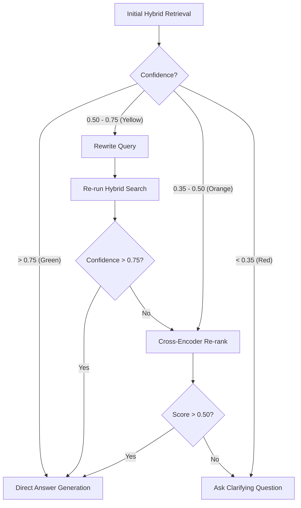

# App Flow & Execution Lifecycles: Phoenix

This document outlines the user journeys, data flow, and cross-service execution lifecycles for **Phoenix**. It details how the system transitions from document ingestion to hybrid retrieval, and specifically how it manages the "Transparent Fallback" mechanism.

---

## 1. Document Ingestion Lifecycle

This flow handles the transition of static PDF data into searchable, vector-indexed knowledge.

1.  **Selection:** User selects a technical PDF via the Document Vault (React).
2.  **Upload:** Frontend sends a `MultipartFile` to `POST /api/documents/upload` (React → Spring Boot).
3.  **Validation:** API verifies file integrity, PDF headers, and size limits (Spring Boot).
4.  **Metadata Initialization:** Create a document record with status `PROCESSING` in PostgreSQL (Spring Boot).
5.  **Handoff:** Spring Boot forwards the file binary and internal ID to the AI Engine via `POST /ingest` (Spring Boot → Python).
6.  **Text Extraction:** PDF text is extracted and cleaned of artifacts (Python).
7.  **Chunking:** Text is broken into overlapping segments using `RecursiveCharacterTextSplitter` to preserve technical context (Python).
8.  **Embedding:** Each chunk is converted into a 384-dimensional vector using `all-MiniLM-L6-v2` (Python).
9.  **Indexing:** Vectors are stored in `pgvector`; keyword indices are updated for BM25 (Python).
10. **Confirmation:** AI Engine sends a success callback to the API (Python → Spring Boot).
11. **Ready State:** API updates document status to `READY`; user sees the document as active in the vault (Spring Boot → React).

---

## 2. Hybrid Query Flow (Happy Path)

This flow occurs when the user query is specific and the system finds high-relevance matches.

1.  **Input:** User types a technical question in the chat interface (React).
2.  **Dispatch:** Frontend sends query and document context to `POST /api/chat/query` (React → Spring Boot).
3.  **Retrieval Initiation:** API calls AI Engine `POST /process-query` (Spring Boot → Python).
4.  **Hybrid Search:** AI Engine executes semantic vector search and BM25 keyword search in parallel (Python).
5.  **Score Fusion:** Results are combined and normalized; a "Retrieval Confidence Score" is calculated (Python).
6.  **Confidence Check:** Score exceeds the high-confidence threshold (e.g., > 0.75) (Python).
7.  **Synthesis:** LLM generates a response strictly using the retrieved chunks (Python).
8.  **Citation Mapping:** AI Engine maps answer segments back to specific chunk IDs and source pages (Python).
9.  **Return:** Response object containing `answer`, `sources`, and `confidence_score` is returned (Python → Spring Boot → React).
10. **Render:** Chat UI displays the answer with clickable source citations and a "High Confidence" badge (React).

---

## 3. Low-Confidence & Fallback Flow

When initial retrieval is ambiguous, the system executes a self-correction loop.

1.  **Detection:** Initial retrieval yields a marginal confidence score (e.g., 0.58) or low confidence score (e.g., 0.42) (Python).
2.  **Trace Logging:** A `ReasoningStepDto` object is initialized and logged into `reasoningTrace`: `{ "step": "INITIAL_RETRIEVAL", "action": "Hybrid search (Vector + BM25)", "outcome": "Marginal confidence (0.58) detected" }` (Python).
3.  **Tiered Evaluation:**
    *   **Marginal Confidence ($0.50 \le CS < 0.75$):** Triggers **Query Rewriting**. The system uses a "Query-to-Query" LLM prompt to expand abbreviations or clarify technical terms, then retries retrieval.
    *   **Low Confidence ($0.35 \le CS < 0.50$) or Failed Rewrite:** Triggers **Cross-Encoder Re-ranking**. Top chunks from combined retrieval attempts are passed through a Cross-Encoder to identify relevant context.
    *   **Terminal Low Confidence ($CS < 0.35$) or Failed Re-ranking:** Triggers **Clarifying Question**. The system aborts generation to prevent hallucination and asks the user for clarification.
4.  **Final Evaluation:** If confidence remains below 0.50 after re-ranking, the system aborts generation and escalates to a clarifying question (Python).
5.  **Handoff:** Return answer (or clarification question) + the complete `reasoningTrace` containing the list of `ReasoningStepDto` objects (Python → Spring Boot → React).

---

## 4. Fallback Reasoning Display (The Differentiator)

This flow details how the UI surfaces the "System Thoughts" to the user to build trust.

1.  **Data Reception:** React receives the payload containing the `reasoningTrace` array.
2.  **Visual Trigger:** If `reasoningTrace` is non-empty, a "System Thought" toggle appears below the chat bubble (React).
3.  **Step Rendering:** User clicks "View Reasoning"; the UI renders a vertical timeline of the self-correction steps (React):
    *   **Step 1:** "Initial search for 'spring ddl' yielded marginal confidence (0.58)."
    *   **Step 2:** "Rewriting query to 'Spring Boot Hibernate DDL auto configuration keys'..."
    *   **Step 3:** "Secondary search failed to reach high confidence (0.48)."
    *   **Step 4:** "Re-ranking top chunks using Cross-Encoder to recover relevance (0.65)."
4.  **Transparency:** The UI explicitly highlights which chunk was chosen by BM25 (Exact Match) vs. Vector (Semantic), showing the user why the hybrid approach was necessary (React).
