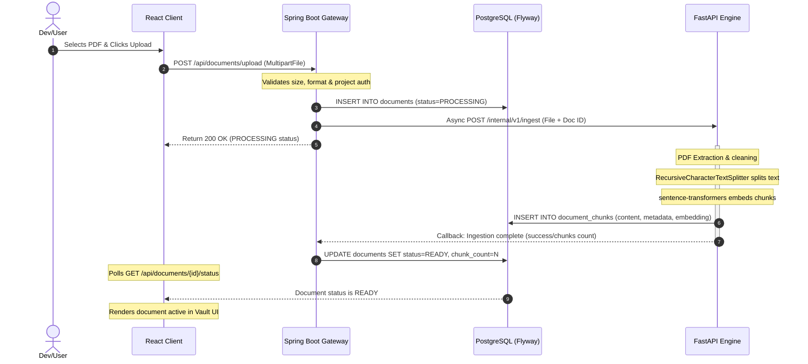
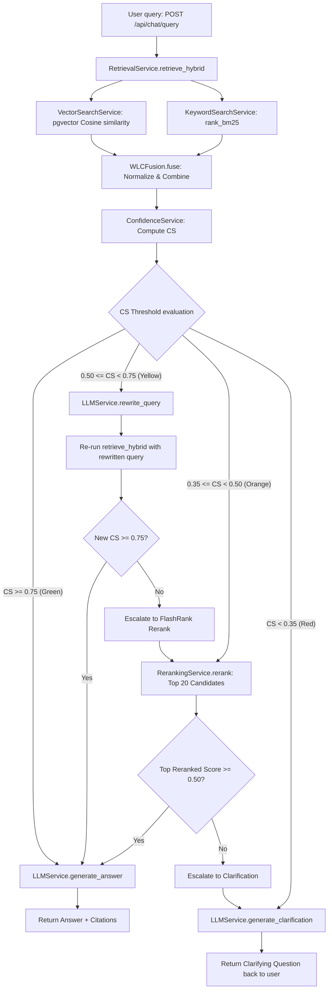

# Application Execution Lifecycles & Flows: Phoenix

This document specifies the sequence of operations, data flows, and cross-service lifecycles implemented in **Phoenix**.

---

## 1. Document Ingestion Lifecycle

This lifecycle converts a static PDF into a series of semantic vector embeddings and text indexes stored in PostgreSQL.

---

## 2. Hybrid RAG Query & Fallback Lifecycle

This lifecycle represents the execution flow for user questions. The `FallbackOrchestrator` handles the retrieval score assessment and transitions between recovery states.

### 2.1 Technical Step-by-Step Flow

1. **Query Submission**: React Client dispatches a JSON body to `POST /api/chat/query` containing the `documentId` and `query` string.
2. **Gateway Verification**: The Spring Boot `ChatController` authenticates the request via the JWT token security filter and maps the principal. It delegates execution to `ChatService.queryRAG()`.
3. **Internal Handoff**: `ChatService` calls `POST /internal/v1/process` on the Python FastAPI service.
4. **Orchestration**: The FastAPI `process` route calls `FallbackOrchestrator.process_query()`:
   * **Initial Retrieval**: Cosine similarity vectors (limit $k \times 2$) are fetched from database chunks via `VectorSearchService.search()` using the `pgvector` distance operator (`<=>`). BM25 keyword search is run in parallel over all chunks via `KeywordSearchService.search()`.
   * **Fusion**: `WLCFusion.fuse()` normalizes BM25 scores and merges chunks using the Weighted Linear Combination formula.
   * **Scoring**: `ConfidenceService.calculate_confidence()` computes the composite score: $CS = 0.6 \cdot MaxSim + 0.4 \cdot Agreement$.
5. **State Decision**:
   * **Green Path ($CS \ge 0.75$)**: Generates the answer directly using the LLM with the context chunks.
   * **Yellow Path ($0.50 \le CS < 0.75$)**: Calls `llm_service.rewrite_query()` to generate a clarified query. Re-runs hybrid retrieval. If new confidence is high, generates the answer; otherwise, escalates to reranking.
   * **Orange Path ($0.35 \le CS < 0.50$)**: Fetches the top 20 candidate chunks, reranks them using the FlashRank cross-encoder model, and evaluates the top score. If the top score $\ge 0.50$, it generates the answer; otherwise, it escalates to clarification.
   * **Red Path ($CS < 0.35$)**: Gathers the top 3 vector chunks to identify close subjects, feeds them to `llm_service.generate_clarification()`, and yields a polite clarification query.
6. **Timeline Logging**: At each state transition, the engine appends a `ReasoningStepDto` object detailing the state name, score, and transition description.
7. **Client Rendering**: React receives the answer payload (containing the reasoning logs, confidence score, and citation indexes) and displays the message, badge, and collapsible reasoning timeline.
