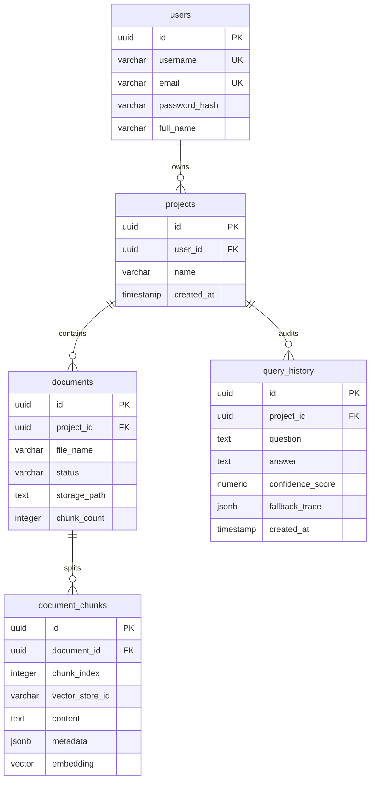

# Database Schema Specification: Phoenix

This document defines the unified database schema for **Phoenix**. Both the Spring Boot Gateway and the FastAPI AI Engine share access to the same PostgreSQL instance to ensure strong data consistency, transactional integrity, and atomic cascade operations.

---

## 1. Entity Relationship Diagram (ERD)

---

## 2. Database Schema Reference

### 2.1 Table: `users`
Tracks user credentials and access tokens. Mapped from the V1 and V6 Flyway migrations.

| Column | Type | Constraints | Description |
| :--- | :--- | :--- | :--- |
| `id` | `UUID` | PRIMARY KEY | Unique identifier generated on client sign-up. |
| `username` | `VARCHAR(255)` | UNIQUE, NOT NULL | Unique display handle and login credential. |
| `email` | `VARCHAR(255)` | UNIQUE, NOT NULL | User contact email and login credential. |
| `password_hash` | `VARCHAR(255)` | NOT NULL | 60-character BCrypt encrypted password. |
| `full_name` | `VARCHAR(255)` | NULLABLE | User's descriptive display name. |

---

### 2.2 Table: `projects`
Logical workspace folder container that isolates files and chat sessions. Mapped from V2.

| Column | Type | Constraints | Description |
| :--- | :--- | :--- | :--- |
| `id` | `UUID` | PRIMARY KEY | Unique project identifier. |
| `user_id` | `UUID` | FOREIGN KEY (users.id), ON DELETE CASCADE | Reference to the owning User. |
| `name` | `VARCHAR(100)` | NOT NULL | Project workspace title. |
| `created_at` | `TIMESTAMP` | NOT NULL | Creation instant in UTC. |

---

### 2.3 Table: `documents`
Tracks metadata and background ingestion pipeline states for uploaded PDFs. Mapped from V3.

| Column | Type | Constraints | Description |
| :--- | :--- | :--- | :--- |
| `id` | `UUID` | PRIMARY KEY | Document unique identifier. |
| `project_id` | `UUID` | FOREIGN KEY (projects.id), ON DELETE CASCADE | Parent project workspace container. |
| `file_name` | `VARCHAR(255)` | NOT NULL | Original disk file name. |
| `status` | `VARCHAR(50)` | NOT NULL | Ingestion state: `PROCESSING`, `READY`, or `FAILED`. |
| `storage_path` | `TEXT` | NOT NULL | Absolute local filesystem path to the uploaded PDF. |
| `chunk_count` | `INTEGER` | NULLABLE | Number of parsed text segments after processing. |

---

### 2.4 Table: `document_chunks`
Stores raw chunk text, metadata properties, and vector embeddings. Mapped from V3 and V4.

| Column | Type | Constraints | Description |
| :--- | :--- | :--- | :--- |
| `id` | `UUID` | PRIMARY KEY | Unique chunk identifier. |
| `document_id` | `UUID` | FOREIGN KEY (documents.id), ON DELETE CASCADE | Parent document container. |
| `chunk_index` | `INTEGER` | NOT NULL | Zero-indexed chunk position. |
| `vector_store_id` | `VARCHAR(100)` | NOT NULL | Duplicate identifier for indexing systems. |
| `content` | `TEXT` | NOT NULL | Raw text segment extracted from the PDF page. |
| `metadata` | `JSONB` | NOT NULL | Stores context attributes (`page_number`, etc.). |
| `embedding` | `VECTOR(384)` | NOT NULL | 384-dimensional vector representation. |

* **Index**: HNSW (Hierarchical Navigable Small World) index configured on `embedding` using cosine distance operations for fast retrieval.

---

### 2.5 Table: `query_history`
Audit trail of queries, responses, score metrics, and orchestrator logs. Mapped from V5.

| Column | Type | Constraints | Description |
| :--- | :--- | :--- | :--- |
| `id` | `UUID` | PRIMARY KEY | Unique log identifier. |
| `project_id` | `UUID` | FOREIGN KEY (projects.id), ON DELETE CASCADE | Scope of the search transaction. |
| `question` | `TEXT` | NOT NULL | Original query string entered by the user. |
| `answer` | `TEXT` | NOT NULL | Generated response or clarification question. |
| `confidence_score` | `NUMERIC` | NOT NULL | Final composite retrieval confidence. |
| `fallback_trace` | `JSONB` | NOT NULL | Serialized list of `ReasoningStepDto` states. |
| `created_at` | `TIMESTAMP` | NOT NULL | Audit sorting timestamp. |

---

## 3. Key Schema Design Decisions

### 3.1 pgvector Integration inside PostgreSQL
Instead of splitting data between PostgreSQL (relational metadata) and a third-party hosted vector database (such as Pinecone), Phoenix implements the `vector` extension directly in Postgres. 
* **Atomic Deletes**: Deleting a project triggers a cascading foreign key cascade down to `documents` and `document_chunks`, automatically wiping physical storage records and vector indices in a single transaction block.
* **Single Database Connection**: Reduces local compute footprint and eliminates network latency bottlenecks.

### 3.2 JSONB Storage for Metadata and Traces
Storing structured dictionary data (such as page indexes in `document_chunks` and step details in `query_history`) in PostgreSQL `JSONB` columns allows schema flexibility. For audit analysis, standard SQL queries can directly fetch attributes inside the JSON payload without requiring separate schema alterations.
