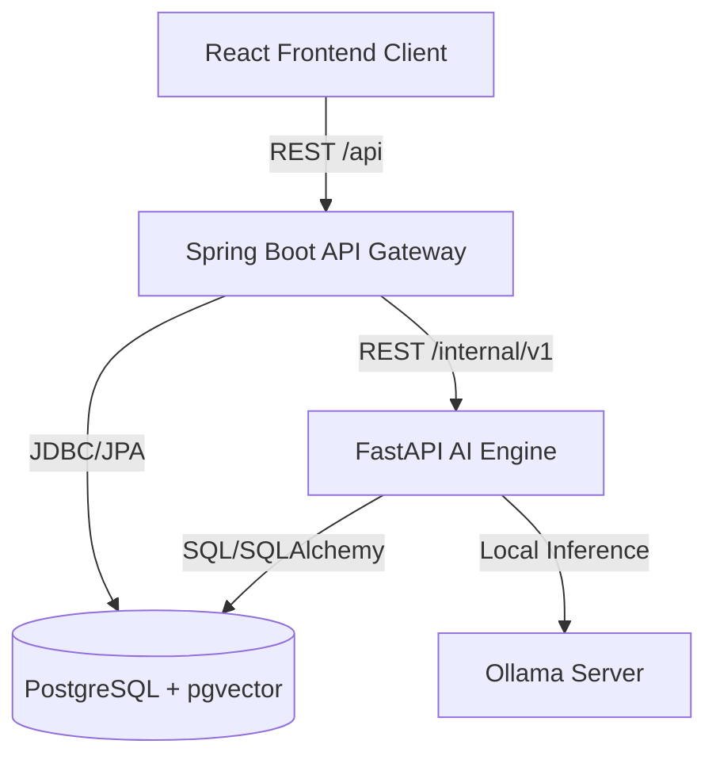
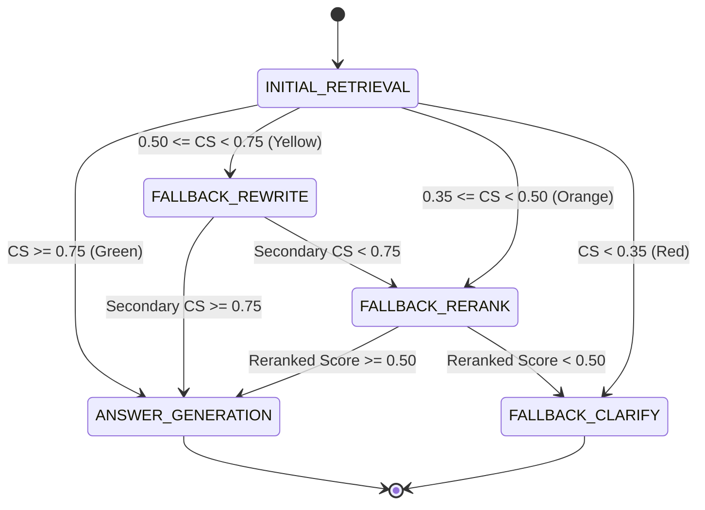

# Internal Engineering Knowledge Base: Phoenix

Welcome to the internal engineering wiki for **Phoenix**. This document captures the system design rationale, algorithmic models, database decisions, troubleshooting workflows, and development guidelines for engineers maintaining or extending the RAG application.

---

## 1. System Architecture & Component Interaction

Phoenix is built using a decoupled, local-first three-tier service architecture:

### 1.1 Service Responsibilities
1. **React Client Console**: Implements a dense technical workspace layout. It manages user session state (Zustand) and renders RAG answers with citations and collapsible execution logs.
2. **Spring Boot Gateway**: Functions as the primary security gateway, request validator, and metadata transaction coordinator. It handles stateless user authorization (JWT), workspace persistence (JPA), and asynchronous background task delegations.
3. **FastAPI AI Engine**: Houses the CPU-heavy AI operations. It parses documents, generates text embeddings, executes hybrid searches, normalized score fusion, and evaluates the fallback state machine.

### 1.2 Request Execution Lifecycles
* **PDF Ingestion**: React Client uploads a PDF binary to Spring Boot, which saves it to disk and asynchronously tells FastAPI to ingest the file. FastAPI parses, chunks, generates embeddings, and inserts them into PostgreSQL. The status transitions from `PROCESSING` to `READY`.
* **RAG Query Execution**: Spring Boot receives the query and forwards it to FastAPI. FastAPI runs parallel Vector and BM25 searches, fuses them, computes confidence, runs any necessary fallbacks, generates the response from Ollama, and returns the result with logs.

---

## 2. RAG Pipeline & Retrieval Mathematics

### 2.1 Chunking & Embeddings
* **Slicing strategy**: `RecursiveCharacterTextSplitter` (size: 800 chars, overlap: 150 chars) using delimiters `["\n\n", "\n", " ", ""]`. This preserves code blocks and YAML property blocks.
* **Vector Models**: `all-MiniLM-L6-v2` generating 384-dimensional dense float vectors, indexed via `pgvector` HNSW indexes using Cosine Distance (`<=>`).

### 2.2 Dual-Engine Hybrid Retrieval
To prevent missing exact alphanumeric strings (like `server.port`), we execute parallel search queries:
1. **Dense Vector Search**: Cosine similarity is computed at database layer:
   $$Sim_{vector} = 1.0 - CosineDistance$$
2. **Sparse Keyword Search**: BM25 Okapi scores are generated dynamically over the document chunks.

### 2.3 MinMaxScaler Score Fusion
Because BM25 raw scores are unbounded $[0, \infty)$ and vector similarities are bounded $[0, 1]$, we normalize BM25 scores before combining them:
$$Score_{bm25\_norm} = \frac{Score - Score_{min}}{(Score_{max} - Score_{min}) + \epsilon}$$
where $\epsilon = 10^{-6}$ prevents division-by-zero. The scores are blended using a Weighted Linear Combination (WLC):
$$Score_{final} = \alpha \cdot Sim_{vector} + (1 - \alpha) \cdot Score_{bm25\_norm}$$
where $\alpha = 0.7$ by default.

### 2.4 Composite Confidence Scoring
Retrieval certainty is computed based on similarity strength and consensus agreement:
$$CS = 0.6 \cdot MaxSim + 0.4 \cdot Agreement$$
* **MaxSim**: Cosine similarity of the top vector match, clamped strictly to $[0, 1]$.
* **Agreement**: Overlap ratio of Top-3 Vector and Top-5 BM25 results:
  $$Agreement = \frac{|Vector_{top3} \cap BM25_{top5}|}{3}$$

### 2.5 Fallback Decision State Machine
The `FallbackOrchestrator` dynamically selects the recovery path based on the composite score ($CS$):

* **Query Rewriting (Yellow)**: Rewrites the user query using the LLM to expand technical abbreviations before re-running retrieval.
* **FlashRank Reranking (Orange)**: Passes the top 20 candidate chunks through the CPU-optimized `ms-marco-MiniLM-L-6-v2` cross-encoder to capture subtle semantic patterns.
* **Clarification Generation (Red)**: Gathers the top 3 vector chunks to formulate a polite clarification question, aborting LLM text generation to prevent hallucinations.

---

## 3. Technology Choices & Trade-offs

### 3.1 pgvector over Pinecone/FAISS
* **Pros**: Relational tables and vector embeddings are stored in a single database. Cascade deletes are atomic.
* **Cons**: Scaling vector indexing requires scaling the database instance.
* **Alternative Considered**: Pinecone (rejected due to cloud costs, synchronization delays, and complex API credential management).

### 3.2 Dynamic BM25 over Elasticsearch
* **Pros**: Ingestion takes < 1.5ms per document. Eliminates the necessity of running a heavy Elasticsearch container locally.
* **Cons**: Search indexing is limited to the single active document context.
* **Alternative Considered**: Elasticsearch / Meilisearch (rejected due to local CPU/memory constraints).

### 3.3 Local Ollama (Mistral-7B) over OpenAI API
* **Pros**: 100% offline, zero inference billing, complete data privacy.
* **Cons**: Slower token generation rates on CPU-only hardware.
* **Mitigation**: Increased client timeouts to **300 seconds** to accommodate weight loading and cold starts.

---

## 4. Troubleshooting & Debugging Guides

### 4.1 Spring Boot Outbound Socket Timeout
* **Symptom**: Frontend queries fail with an HTTP 500 error, and Spring Boot logs show: `java.net.SocketTimeoutException: Read timed out`.
* **Cause**: Ollama is loading model weights (cold start) or processing a long reasoning trace, exceeding the default 60-second read timeout.
* **Resolution**: Ensure [RestClientConfig.java](../backend/src/main/java/com/resume/phoenix/document/config/RestClientConfig.java#L19) and [llm.py](../ai-engine/app/services/llm.py#L76) are configured with a `300` second (5 minute) read timeout.

### 4.2 Database Connection Pool Exhaustion
* **Symptom**: Spring Boot freezes during bulk document uploads, throwing `HikariPool-1 - Connection is not available`.
* **Cause**: Ingestion threads fail to close database sessions, or long-running Python API calls are holding connections open.
* **Resolution**: Ensure database sessions are committed or closed properly.

### 4.3 Reranker Cache Mismatch
* **Symptom**: Orange Path queries fail on first execution.
* **Cause**: FlashRank is downloading ONNX models in the background, causing a timeout.
* **Resolution**: Let the download finish. If execution continues to fail, verify that [reranking.py](../ai-engine/app/services/reranking.py#L68) falls back to mock ranking mode when ONNX models fail to load.

---

## 5. Development Guidelines & Best Practices

* **Adding New LLM Models**: Register the model name in Ollama and configure it via `OLLAMA_MODEL` in the environment files.
* **Extending REST APIs**: Ensure new endpoints require authentication by default in `SecurityConfig.java`. Validate request bodies in Java controllers using `@Valid` DTO annotations.
* **Preserving Transparency**: When adding RAG features, append reasoning steps containing step states, scores, and text details to `ReasoningStepDto` arrays to preserve explainability in the React client timeline panel.
