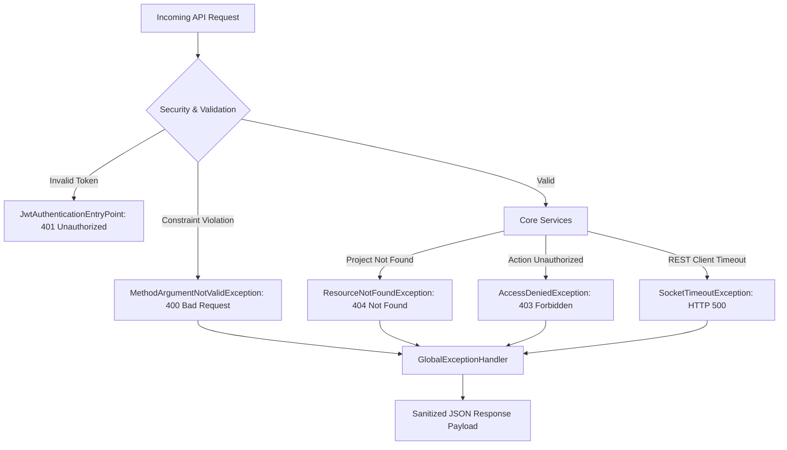

# Error Handling & Resiliency Specification: Phoenix

This document specifies the validation systems, exception translations, system recovery processes, and logging standards implemented in **Phoenix**.

---

## 1. Exception Classification Matrix

Phoenix segments failures into specific domains to ensure accurate client reporting and server recovery:



| Exception Type | Triggering Source | Response Code | JSON Response Structure |
| :--- | :--- | :--- | :--- |
| **Validation Failures** | MethodArgumentNotValidException | `400 Bad Request` | Map of `{ "field": "Error description" }` |
| **Invalid Parameters** | IllegalArgumentException | `400 Bad Request` | `{ "error": "Exception details" }` |
| **Resource Missing** | ResourceNotFoundException | `404 Not Found` | `{ "error": "Not Found", "message": "Details" }` |
| **Forbidden Action** | AccessDeniedException | `403 Forbidden` | `{ "error": "Forbidden", "message": "Access is denied" }` |
| **Auth Failures** | JwtAuthenticationEntryPoint | `401 Unauthorized` | Handled at filter level; returns empty body or standard Tomcat block. |
| **Service Timeouts** | SocketTimeoutException | `500 Internal Server` | `{ "error": "Internal Server Error", "message": "Read timed out" }` |

---

## 2. Java Gateway Translation (Spring Boot)

All system-level exceptions are caught and sanitized by the Spring `@RestControllerAdvice` class [GlobalExceptionHandler.java](../backend/src/main/java/com/resume/phoenix/exception/GlobalExceptionHandler.java).

### 2.1 Validation Error Responses
When REST request parameters fail constraints, the handler returns a detailed validation map:
```json
{
  "email": "Email must be valid",
  "username": "Username is required"
}
```

### 2.2 Resource Missing Responses
When a requested workspace or document ID does not exist:
```json
{
  "error": "Not Found",
  "message": "Project not found with id: 68a2878e-aa01-43c4-9f48-6ad150b7fe03"
}
```

---

## 3. Resiliency & Fallback Strategy

### 3.1 Downstream Service Timeouts
* **The Problem**: Local Ollama weights compilation and prompt evaluations can exceed standard timeouts, resulting in connection drops.
* **The Fix**: Outbound connection limits have been raised to **300 seconds (5 minutes)**. If the Python FastAPI service fails to return a response within this window, the Spring RestClient raises a `SocketTimeoutException`, which is returned to the frontend as a `500 Internal Server Error`.

### 3.2 Python In-Memory Fallbacks
In the FastAPI AI Engine, internal retrieval operations feature programmatic fallbacks to prevent crashes:
* **FlashRank Fallback**: If the `flashrank` ranker initialization fails, the service falls back to a **Mock Reranker** in [reranking.py](../ai-engine/app/services/reranking.py#L68) which simulated scores rather than crashing.

---

## 4. Frontend Alert States & Fail-safes

If the backend API returns a non-2xx status, the React frontend displays sanitized alerts:
* **Ingestion Failures**: If a PDF document is corrupted, the polling status returns `FAILED` and renders a red state alert in the Document Vault.
* **Connection Drops**: If the Spring Boot service goes offline, the console displays: *"RAG query failed. Please verify the backend and retrieval services are operational."*

---

## 5. System Logging Standards

### 5.1 Spring Boot Logging
* **Console Pattern**: Uses SLF4J and Logback to trace execution.
* **Database Tracing**: Configured with parameter binding trace levels in application properties:
  * `logging.level.org.hibernate.SQL=DEBUG`
  * `logging.level.org.hibernate.orm.jdbc.bind=TRACE`
  This prints SQL statements and bound variables directly to the logs for easy debugging.

### 5.2 FastAPI Ingestion Logs
Uvicorn logs incoming REST routing status codes (e.g. `POST /internal/v1/process HTTP/1.1 200 OK`) and progress bars representing local SentenceTransformer batch encoding.
