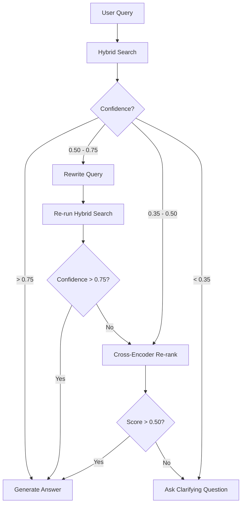

# Fallback Strategies: The "Graceful Uncertainty" Design

This document details the design and implementation of the **Phoenix** fallback state machine. Unlike standard RAG systems that attempt to answer every query regardless of retrieval quality, Phoenix prioritizes **transparency and accuracy**. When retrieval confidence ($CS$) falls below predefined thresholds, the system executes a multi-tiered fallback strategy to either improve the search or admit uncertainty.

---

## 1. Strategy I: Query Rewriting (Expansion & Contextualization)

Query Rewriting is the first line of defense when a user's prompt is too brief, contains ambiguous abbreviations, or lacks technical context found in the documentation.

*   **Trigger Condition:** Marginal Confidence ($0.50 \le CS < 0.75$).
*   **Methodology:** The system passes the original query to a lightweight "Search-Optimizer" LLM prompt. The goal is to produce a "HyDE-light" (Hypothetical Document Embeddings) expansion.
    *   **Expansion:** Abbreviation expansion (e.g., "JPA" $\rightarrow$ "Java Persistence API").
    *   **Contextualization:** Adding implied keywords based on the document's domain (e.g., adding "Spring Boot configuration" to a query about "server port").
*   **Retry Logic:** 
    *   The reformulated query is passed back through the **Hybrid Search** engine.
    *   **Max Retry Count:** 1. Multiple retries are avoided to prevent excessive latency and token consumption.
*   **Success Metric:** If the second retrieval's $CS$ is higher than the first, the system proceeds to Generation; otherwise, it moves to Tier II (Re-ranking).

---

## 2. Strategy II: Cross-Encoder Re-ranking

Initial retrieval (Vector + BM25) is a "Bi-Encoder" approach—fast but lacking deep interaction between query and document terms. Re-ranking provides a deeper, more computationally expensive evaluation of a smaller candidate set.

*   **Trigger Condition:** Low Confidence ($0.35 \le CS < 0.50$) OR after a failed Query Rewrite.
*   **Methodology:** The system takes the Top-20 chunks from the combined retrieval attempts and passes them through a **Cross-Encoder** (FlashRank).
*   **Mechanism:** Unlike Bi-Encoders that pre-compute embeddings, the Cross-Encoder processes the `(Query, Chunk)` pair simultaneously, allowing it to detect nuanced relationships and exact technical matches that the initial similarity search missed.
*   **Output:** The chunks are re-ordered based on the Cross-Encoder’s relevance score. If the top re-ranked chunk exceeds a "Recovery Threshold" (0.50), the system proceeds to generation.

---

## 3. Strategy III: Clarifying Questions (The Hallucination Kill-Switch)

This is the "Red" state where the system determines that the provided documentation does not contain the answer, or the query is fundamentally incompatible with the available context.

*   **Trigger Condition:** Terminal Low Confidence ($CS < 0.35$) after all retrieval attempts.
*   **Methodology:** Instead of generating an answer based on irrelevant chunks, the system generates a **Clarification Prompt**.
*   **Generation Logic:** The LLM is provided with:
    1.  The User Query.
    2.  A summary of the *closest* (but still irrelevant) topics found in the document.
    *   **Output Example:** "I found information regarding 'Database Connectivity,' but nothing specifically about 'NoSQL Cluster Sharding.' Could you clarify if you are looking for a different configuration?"
*   **Context Persistence:** The original query and the failure reason are stored in the `reasoningTrace` to ensure the user understands why the system is asking for more information.

---

## 4. The Decision Tree: Sequence & Priority

Phoenix follows a **Strict Sequential Escalation** to balance speed and accuracy.

### Rationale for this Order:
1.  **Rewrite First:** We fix the *intent* first. If the user's phrasing was poor, no amount of re-ranking will find the right data.
2.  **Re-rank Second:** If the intent is clear but the search was "noisy," re-ranking separates the signal from the noise.
3.  **Clarify Last:** This is the safety valve. We only admit "defeat" after trying to self-correct the search logic.

---

## 5. UI Surface: "Show Your Reasoning"

A core differentiator of Phoenix is making this state machine visible to the user.

*   **The Reasoning Trace:** The API response includes a `reasoningTrace` array.
*   **Frontend Representation:**
    *   **Status Badges:** "Verified Source" (Green), "Self-Corrected Search" (Yellow), "Low Confidence" (Orange).
    *   **The Thought Timeline:** A collapsible UI component that reveals the steps:
        *   *"Initial search was ambiguous..."*
        *   *"Rewrote query to include 'Spring Boot'..."*
        *   *"Re-ranked 20 passages to find exact technical match."*
*   **User Benefit:** This builds "Calibrated Trust." The user knows exactly when the system is confident and when it had to work harder to find the answer, reducing the risk of them blindly following a potentially incorrect response.

---
**Related Documentation**
* [Phoenix RAG Architecture](file:///path/to/RAG_Architecture.md)
* [Phoenix API Specification](file:///path/to/API_SPECIFICATION.md)