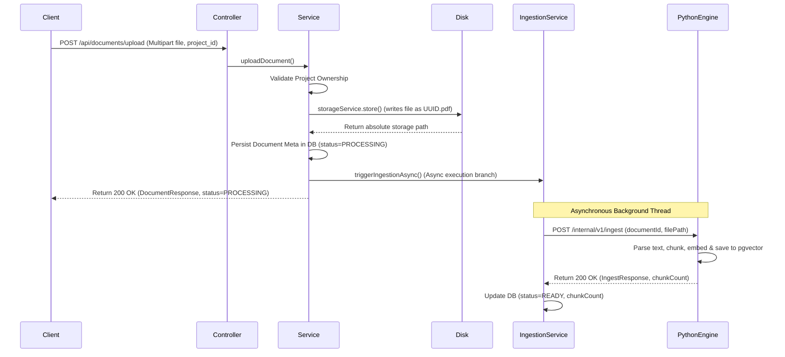

# Document Upload Lifecycle & Ingestion Integration

This document details the multipart file upload process, filesystem storage logic, path traversal prevention, and asynchronous FastAPI callback integration implemented in Phase 04 of the Phoenix project.

---

## 1. What Problem is Being Solved?

In a Retrieval-Augmented Generation (RAG) system:
1. **Large Binary Ingestion:** Users upload PDF files containing technical contents. The system must accept these multipart requests and save them to a local filesystem store.
2. **Path Traversal Vulnerabilities:** Filenames uploaded by users are untrusted. An attacker could upload a file with name `../../etc/passwd` to overwrite system files.
3. **Slow Python Callbacks:** Extracting text, chunking, and embedding PDFs is a computationally expensive operation on the Python AI Engine. Making a synchronous HTTP call to Python during the upload request would cause timeouts and block backend execution threads.

---

## 2. Why This Solution Was Selected?

Phoenix implements a hybrid **Asynchronous Handoff Store** strategy:
- **Filesystem Persistence:** Saves the file on disk first, enabling the Python engine to read from a shared/local directory directly.
- **UUID-based File Naming:** Overwrites filesystem storage names to `UUID.pdf`, preventing collision, non-ASCII character corruptions, and path traversal completely.
- **Asynchronous Execution:** Implements `@Async` methods handled by Spring's task scheduler. The client immediately gets a `200 OK` with status `PROCESSING`. The background thread handles the HTTP post to FastAPI, updating state to `READY` or `FAILED`.
- **RestClient with Explicit Timeouts:** Utilizes Spring 3.3's `RestClient` configured with a short connect timeout (5s) to detect service outages fast, and a long read timeout (60s) to give the Python engine sufficient time to process large documents.

---

## 3. Alternative Approaches Considered

### A. Database BLOB Storage
* **Pros:** Simpler backups, transactions apply to file data.
* **Cons:** Bloats relational database, high memory consumption, and Python AI engine cannot read files natively without a DB connection.
* **Phoenix Decision:** Rejected in favor of local filesystem workspace storage.

### B. Reactive WebClient Non-Blocking Calls
* **Pros:** Highly resource-efficient, async by design.
* **Cons:** Pulls in heavy reactive dependencies (`spring-boot-starter-webflux`).
* **Phoenix Decision:** Rejected in favor of standard `@Async` servlet execution and Spring 3.3 `RestClient.Builder` to maintain a simple, lightweight thread-per-request architecture.

---

## 4. Internal Implementation & Phoenix Usage

---

## 5. Important Classes and Packages

- `com.resume.phoenix.document.config.StorageProperties`: Binds properties (`app.storage.upload-dir`).
- `com.resume.phoenix.document.service.StorageService`: Validates path segments, sanitizes original name, and writes files.
- `com.resume.phoenix.document.config.RestClientConfig`: Configures timeouts and builds the `RestClient.Builder` bean.
- `com.resume.phoenix.document.service.PythonIngestionService`: Contains the `@Async` execution logic communicating with FastAPI.
- `com.resume.phoenix.document.controller.DocumentController`: Exposes the public endpoints.

---

## 6. Common Pitfalls & Debugging Tips

- **Internal Async Self-Invocation:**
  Calling an `@Async` method from another method in the same bean bypasses the AOP proxy, running synchronously.
  *Fix:* Move the `@Async` method to a separate Spring bean (`PythonIngestionService.java`).
- **Testing RestClient with MockRestServiceServer:**
  Spring's `MockRestServiceServer.bindTo(...)` accepts `RestClient.Builder`, not `RestClient` directly.
  *Fix:* Define `RestClient.Builder` as a managed Spring bean in config, and inject it into both services (calling `build()`) and tests.

---

## 7. Interview Discussion Points

- **Q:** How do you test asynchronous operations in integration tests?
- **A:** We use `MockRestServiceServer` to mock the HTTP callback, perform MockMvc calls, and use a brief wait (`Thread.sleep` or Awaitility) in the test case to allow the background task to execute. After the wait, we verify the mock server expectations and assert that the database record updated to the expected status.

---

## 8. References

- [Spring REST Clients Reference](https://docs.spring.io/spring-framework/reference/integration/rest-clients.html)
- [OWASP Path Traversal Prevention Guide](https://owasp.org/www-community/attacks/Path_Traversal)
