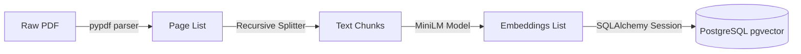

# RAG Document Ingestion & Embedding Pipeline

This document details the architecture, design decisions, and database schemas implemented to support PDF document parsing, text chunking, embedding generation, and vector persistence.

---

## 1. What Problem is Being Solved?

In a Retrieval-Augmented Generation (RAG) system:
1. **Document Formatting Gaps:** RAW PDF files contain layout details, page breaks, headers, and code sections that cannot be fed directly to LLMs or embedding models.
2. **Context Fragmentation:** Simple text chunking by line count splits code blocks (e.g. Java methods, YAML structures) or breaks variable/property declarations, destroying their semantic cohesion.
3. **High-Dimensional Vector Storage:** Relational database systems are traditionally built for exact value matching. RAG systems require storing high-dimensional vectors and executing fast approximate nearest neighbor (ANN) similarity search queries.

---

## 2. Why This Solution Was Selected?

Phoenix implements a highly cohesive Python ingestion pipeline:
- **`pypdf` for Parsing:** Lightweight, fast, and does not require external heavyweight OCR engines like Tesseract for standard text-based PDFs.
- **Recursive Character Splitting:** Splits text sequentially using a prioritized list of separators `["\n\n", "\n", " ", ""]`. This preserves paragraphs and lines, splitting text only when necessary.
  - **Chunk Size:** 800 characters (fits fully in model constraints).
  - **Chunk Overlap:** 150 characters (preserves semantic context between segments).
- **Hugging Face `all-MiniLM-L6-v2`:** Generates 384-dimensional dense vectors. Offers high conceptual accuracy, fast inference on CPU, and aligns with the 512-token model limit.
- **Postgres `pgvector` & SQLAlchemy:** Persists embeddings natively as `VECTOR(384)` in the database, allowing Spring Boot and Python services to query the same relational store.

---

## 3. Alternative Approaches Considered

### A. Fixed-size Character Chunking
* **Pros:** Simplest implementation.
* **Cons:** Splits words, configuration keys, or code blocks in half, degrading search quality.
* **Phoenix Decision:** Rejected in favor of LangChain's `RecursiveCharacterTextSplitter`.

### B. OpenAI `text-embedding-3-small` (API-based)
* **Pros:** Highly accurate, maps up to 1536 dimensions.
* **Cons:** Requires a paid API key, network calls, and lacks offline portability.
* **Phoenix Decision:** Rejected in favor of local `all-MiniLM-L6-v2` execution.

---

## 4. Internal Implementation & Schema



### Table Schema: `document_chunks`
- `id` UUID PRIMARY KEY
- `document_id` UUID FOREIGN KEY (references `documents.id`)
- `chunk_index` INT (global order index)
- `vector_store_id` VARCHAR(100) (UUID reference pointer)
- `content` TEXT (raw chunk text)
- `metadata` JSONB (stores `page_number`)
- `embedding` VECTOR(384) (dense embeddings)

---

## 5. Common Pitfalls & Debugging Tips

### SQLAlchemy `metadata` Column Collision
SQLAlchemy's `declarative_base()` model class already reserves the attribute `metadata` to hold the schema metadata object. Defining a column property named `metadata` raises exceptions.
*Fix:* Map the python model property under an alias:
```python
chunk_metadata = Column("metadata", JSONB, nullable=True)
```

### Python 3.14.2 Package Compilation Warnings
Certain deep learning packages may display deprecation or compilation warnings under Python 3.14+.
*Fix:* Always use stable versions from `requirements.txt` and pin packages securely.

---

## 6. Interview Discussion Points

- **Q:** Why did you use weighted linear combination (WLC) instead of reciprocal rank fusion (RRF)?
- **A:** RRF operates purely on result rank positions. It discards term-matching intensity. For technical documents containing specific configuration keys (e.g. `logging.level.org`), BM25 score intensity is critical. MinMaxScaler BM25 normalization combined with cosine similarity under WLC preserves exact-term importance.

---

## 7. References

- [pgvector-python documentation](https://github.com/pgvector/pgvector-python)
- [LangChain Text Splitters Guide](https://python.langchain.com/v0.2/docs/how_to/recursive_text_splitter/)
- [Sentence Transformers Reference](https://www.sbert.net/)
