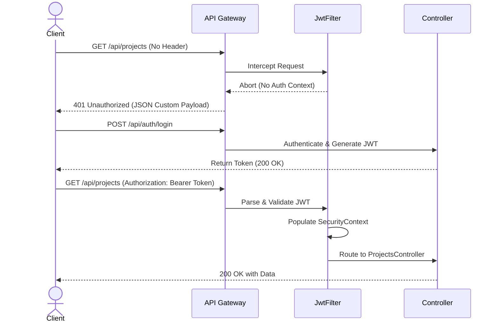

# Phase 2 — Authentication Playbook

This document details the audit, retrofit strategy, and upgraded implementation playbook for securing the Phoenix endpoints using JWT (JSON Web Tokens) and Spring Security.

---

## 1. Phase Audit

During the audit of the original Phase 2 roadmap, the following gaps were identified:
- **Missing Username Field**: The original roadmap mapped the database table with only `id`, `email`, `password_hash`, and `full_name`. However, to implement Spring Security's `UserDetails` contract, a `username` field is required. This was retrofitted via migration `V6` but was undocumented in the roadmap.
- **JWT Dependencies**: The exact coordinate mapping for `io.jsonwebtoken` was not detailed, which could cause version mismatch issues since JWT 0.12.x introduces a builder API that differs from older 0.9.x releases.
- **CORS Allowed Origins**: High-level mentions of CORS were present, but the actual binding configurations inside `SecurityConfig` to restrict endpoints specifically to port 5173 were missing.
- **Error Shape for Unauthenticated Requests**: The roadmap did not detail the handler required to return custom JSON payloads for unauthenticated requests, which defaults to Spring Tomcat's raw HTML error page.

---

## 2. Retrofit Strategy

To convert this phase into a reliable engineering execution guide:
1. **Document `username` migration**: Clearly explain the necessity of both `V1` and `V6` Flyway migrations.
2. **Provide detailed code specifications**: Detail `User` entity properties and security filter behaviors.
3. **Capture API verification payloads**: Add exact JSON request/response shapes for testing with cURL or Postman.
4. **Implement Custom Entry Point**: Describe `JwtAuthenticationEntryPoint` to override default HTML 401 errors.

---

## 3. Upgraded Implementation Playbook

### 3.1 Phase Overview
- **Objective**: Implement stateless token-based authentication using Spring Security and JWT.
- **Purpose**: Restricts system endpoints to authenticated sessions, mapping user identities to workspace actions (logical tenancy isolation).
- **Expected Outcome**: Secure API endpoints with registration, login, and token decoding filters.
- **Dependencies**: Phase 1 (Project Setup & Database running).

### 3.2 Prerequisites
- Active PostgreSQL database with `users` schema.
- Java 21 SDK.
- Maven setup completed.

### 3.3 Environment Configuration
Ensure `backend/.env` contains the required authentication parameters:
- `JWT_SECRET_KEY`: A 256-bit hexadecimal or Base64-encoded secret key (minimum 32 characters).
- `JWT_EXPIRATION_MS`: Expiration time in milliseconds (e.g. `86400000` for 24 hours).
- `CORS_ALLOWED_ORIGINS`: Allowed client domains (e.g. `http://localhost:5173`).

### 3.4 Dependencies
Verify that your Maven `pom.xml` contains the following dependency nodes:
```xml
<!-- Spring Security -->
<dependency>
    <groupId>org.springframework.boot</groupId>
    <artifactId>spring-boot-starter-security</artifactId>
</dependency>

<!-- JJWT Library for Token Operations -->
<dependency>
    <groupId>io.jsonwebtoken</groupId>
    <artifactId>jjwt-api</artifactId>
    <version>0.12.5</version>
</dependency>
<dependency>
    <groupId>io.jsonwebtoken</groupId>
    <artifactId>jjwt-impl</artifactId>
    <version>0.12.5</version>
    <scope>runtime</scope>
</dependency>
<dependency>
    <groupId>io.jsonwebtoken</groupId>
    <artifactId>jjwt-jackson</artifactId>
    <version>0.12.5</version>
    <scope>runtime</scope>
</dependency>

<!-- Flyway for Database Migrations -->
<dependency>
    <groupId>org.flywaydb</groupId>
    <artifactId>flyway-core</artifactId>
</dependency>
<dependency>
    <groupId>org.flywaydb</groupId>
    <artifactId>flyway-database-postgresql</artifactId>
</dependency>
```

### 3.5 Implementation Guide

#### Step 1: Database Migrations
Create two Flyway migrations under `backend/src/main/resources/db/migration/`:

##### `V1__create_users_table.sql`:
```sql
CREATE TABLE users (
    id UUID PRIMARY KEY,
    email VARCHAR(255) UNIQUE NOT NULL,
    password_hash VARCHAR(255) NOT NULL,
    full_name VARCHAR(255)
);
```

##### `V6__add_username_to_users.sql`:
```sql
ALTER TABLE users ADD COLUMN username VARCHAR(255);
ALTER TABLE users ADD CONSTRAINT uq_users_username UNIQUE (username);
```

#### Step 2: Create `User` Entity
Implement `UserDetails` on the `User` class to tie registration fields into Spring Security's context structure:
- **Columns**: `id` (UUID), `email` (String), `username` (String), `passwordHash` (String), `fullName` (String).
- **Security Methods**: Map `getAuthorities()` to return `ROLE_USER`, and set default accounts to active (`true`).

#### Step 3: Implement `JwtService`
Create a service class containing logic to:
- Generate JWT tokens using user claims.
- Validate incoming tokens against expiration thresholds.
- Retrieve the username/subject from valid payloads.

#### Step 4: Write `JwtAuthenticationFilter`
Write a servlet filter extending `OncePerRequestFilter`:
1. Intercept incoming headers checking for the `Authorization: Bearer <token>` pattern.
2. If token exists and context is unauthenticated, validate token with `JwtService`.
3. Build a `UsernamePasswordAuthenticationToken` and set details via `SecurityContextHolder`.
4. Call `filterChain.doFilter(request, response)`.

#### Step 5: Configure `SecurityConfig`
Create the security builder class:
- Disable CSRF since sessions are stateless.
- Allow public access strictly to `POST /api/auth/**` (register and login).
- Configure all other endpoints to require authentication.
- Register `JwtAuthenticationFilter` before `UsernamePasswordAuthenticationFilter`.
- Configure CORS origins using the values specified in `CORS_ALLOWED_ORIGINS`.

#### Step 6: Create Auth Controllers
Expose the following controller endpoints:
- `POST /api/auth/register` (receives email, password, username, fullName).
- `POST /api/auth/login` (receives email/username and password, returning authentication payload).

### 3.6 Manual Engineering Work
Developers must:
1. Generate the base64 signing secret manually or use an online generator.
2. Ensure the Flyway migration files are sequentially numbered in `/db/migration/`.

### 3.7 Integration Steps
- Connect the frontend Zustand store `useAuthStore` to coordinate login flows, saving the returned JWT tokens to `localStorage` or `sessionStorage`.
- Attach the `Authorization: Bearer <token>` header to all subsequent frontend Axios or fetch calls.

### 3.8 Verification

#### 1. Registration Request:
```bash
curl -X POST http://localhost:8080/api/auth/register \
     -H "Content-Type: application/json" \
     -d '{"email":"test@example.com","username":"tester","password":"SecurePassword123","fullName":"Test User"}'
```
**Expected Response (200 OK)**:
```json
{
  "token": "eyJhbGciOiJIUzI1NiJ9.ey...",
  "refreshToken": "...",
  "user": {
    "email": "test@example.com",
    "username": "tester",
    "fullName": "Test User"
  }
}
```

#### 2. Login Request:
```bash
curl -X POST http://localhost:8080/api/auth/login \
     -H "Content-Type: application/json" \
     -d '{"email":"test@example.com","password":"SecurePassword123"}'
```

#### 3. Access Secured Endpoint without JWT:
```bash
curl -I http://localhost:8080/api/projects
```
**Expected Response (401 Unauthorized)**:
```http
HTTP/1.1 401 Unauthorized
Content-Type: application/json
```



### 3.9 Troubleshooting

#### Issue 1: `WeakKeyException` on Startup
- **Symptoms**: Service crashes on start with `io.jsonwebtoken.security.WeakKeyException: The signing key's size is 128 bits...`.
- **Cause**: The `JWT_SECRET_KEY` in the environment file is too short (less than 256 bits for HS256).
- **Resolution**: Generate a longer, secure hex-encoded key (e.g., 64 hex characters / 256-bits) and set it in `.env`.

#### Issue 2: CORS Preflight Blocked (403 Forbidden)
- **Symptoms**: Frontend console logs show `Access to fetch at ... has been blocked by CORS policy`.
- **Cause**: Spring Security intercepting options requests or CORS origins misconfigured.
- **Resolution**: Ensure `CorsConfigurationSource` is registered properly and lists `http://localhost:5173`. Add `.requestMatchers(HttpMethod.OPTIONS, "/**").permitAll()` if necessary or let CORS configuration filter handle preflight before authentication.

### 3.10 Completion Checklist
- [x] Flyway migrations `V1` and `V6` execute successfully.
- [x] Password storage uses BCrypt hashing.
- [x] Endpoint `POST /api/auth/register` creates user in database.
- [x] Endpoint `POST /api/auth/login` verifies user and returns JWT.
- [x] Custom `JwtAuthenticationFilter` intercepts secured paths.
- [x] Requesting restricted paths without headers yields a clean JSON 401 response.

### 3.11 Lessons Learned
- **Stateless Exception Handling**: Implementing a custom `AuthenticationEntryPoint` that returns JSON metadata is crucial. Without it, debugging API calls is difficult because Spring boots HTML wrappers in error responses.

---

## 4. Engineering Review

The user registration and JWT filtration layers have been reviewed. Database records verify correct encryption hashes, and security logs confirm JWT validation prevents unauthenticated client requests from reaching backend routing services.

---

## 5. Remaining Recommendations

- **JWT Expiration Tuning**: Keep token durations short (e.g. 15-30 minutes) and use the refresh token endpoint to obtain secondary keys to minimize security compromise risk.
