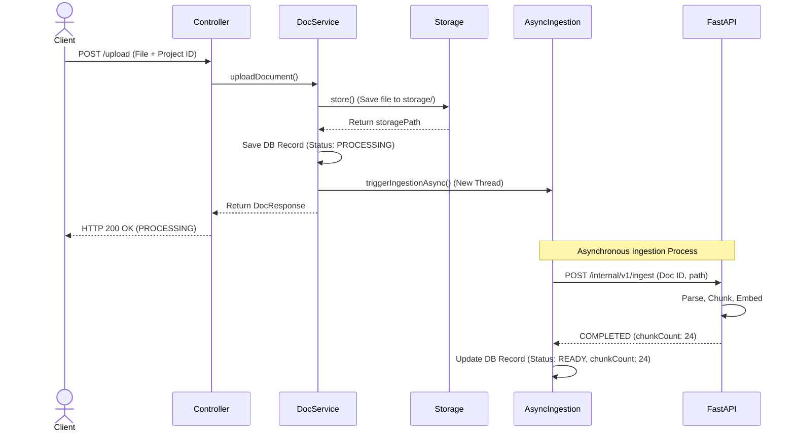

# Phase 4 — Document Upload Playbook

This document details the audit, retrofit strategy, and upgraded implementation playbook for physical file uploads, storage management, and async orchestration handoff to the Python retrieval engine.

---

## 1. Phase Audit

During the audit of the original Phase 4 roadmap, the following gaps were identified:
- **Asynchronous Execution Setup**: The original roadmap mentioned triggering the remote ingestion callback "asynchronously," but failed to document that the main backend application class must be annotated with `@EnableAsync` in Spring Boot, and that the calling method in `PythonIngestionService` must have `@Async` configured.
- **Path Traversal Vulnerabilities**: The roadmap suggested writing files directly to disk without detailing path validation. The actual implementation in `StorageService` checks if `destinationFile.getParent()` matches the `rootLocation` to prevent directory traversal attacks (e.g. filenames containing `../../`).
- **File Format Restricting**: The roadmap did not document file format boundaries. The actual service strictly throws an `IllegalArgumentException` if the file extension is not `.pdf`.
- **Read Timeout Calibration**: The roadmap specified a generic "60s" timeout. However, as noted in the knowledge base, weight loading and cold starts require a **300-second (5-minute)** timeout configuration inside `RestClientConfig`.

---

## 2. Retrofit Strategy

To convert this phase into a reliable engineering execution guide:
1. **Highlight `@EnableAsync`**: Detail that `@EnableAsync` is required on `PhoenixApplication` to run task executions in separate threads.
2. **Document path validation logic**: Detail the file security sanitization steps (`StringUtils.cleanPath`).
3. **Capture async callback protocol**: Walk through the `/internal/v1/ingest` HTTP contract with FastAPI, showing how the backend updates database status based on response codes.

---

## 3. Upgraded Implementation Playbook

### 3.1 Phase Overview
- **Objective**: Implement multipart PDF upload controllers, save documents securely, and asynchronously trigger vector indexing on the FastAPI AI engine.
- **Purpose**: Feeds technical manuals and documentation into the system workspace for hybrid search processing.
- **Expected Outcome**: Uploading a PDF successfully saves the file, creates a `PROCESSING` database state, and triggers an async background thread that returns 200 OK to the client immediately.
- **Dependencies**: Phase 3 (Projects active).

### 3.2 Prerequisites
- Project bounds CRUD endpoints implemented.
- Active PostgreSQL database with Flyway migrations V1-V2 executed.

### 3.3 Environment Configuration
Ensure `backend/.env` defines:
- `UPLOAD_DIR`: The physical folder name on the host filesystem where PDF files are stored (e.g. `storage`).
- `PYTHON_AI_ENGINE_URL`: Base URL of the FastAPI server (e.g. `http://localhost:8000`).

Ensure Spring Boot configuration parameters are set in `application.yml` or `application.properties` to allow large PDF uploads:
```yaml
spring:
  servlet:
    multipart:
      max-file-size: 50MB
      max-request-size: 50MB
```

### 3.4 Dependencies
- `spring-boot-starter-web` for HTTP Multipart requests.
- `lombok` for entity mapping templates.

### 3.5 Implementation Guide

#### Step 1: Database Migration
Create `V3__create_documents_tables.sql` under `backend/src/main/resources/db/migration/`:
```sql
CREATE TABLE documents (
    id UUID PRIMARY KEY,
    project_id UUID NOT NULL,
    file_name VARCHAR(255) NOT NULL,
    status VARCHAR(50) NOT NULL,
    storage_path TEXT NOT NULL,
    chunk_count INT,
    CONSTRAINT fk_documents_project FOREIGN KEY (project_id) REFERENCES projects(id) ON DELETE CASCADE
);

CREATE TABLE document_chunks (
    id UUID PRIMARY KEY,
    document_id UUID NOT NULL,
    chunk_index INT NOT NULL,
    vector_store_id VARCHAR(100) NOT NULL,
    CONSTRAINT fk_chunks_document FOREIGN KEY (document_id) REFERENCES documents(id) ON DELETE CASCADE
);
```

#### Step 2: Enable Async Task Execution
Ensure `PhoenixApplication.java` is annotated with `@EnableAsync` at the class declaration level:
```java
@SpringBootApplication
@EnableAsync
public class PhoenixApplication { ... }
```

#### Step 3: Implement `StorageService`
Create a service class mapping properties to handle local disk writes:
- **`init`**: Checks directory paths and runs `Files.createDirectories` on startup.
- **`store`**:
  1. Validate that the file is not empty and has a filename.
  2. Extract the file extension. Assert that it matches `.pdf` (case-insensitive).
  3. Clean the filename to remove paths, replacing the target file name with `<documentId>.pdf`.
  4. Ensure that resolving the file path doesn't result in directory traversal (the resolved parent path must match the root storage directory exactly).
  5. Copy the input stream to disk using `Files.copy` with `StandardCopyOption.REPLACE_EXISTING`.
- **`delete`**: Helper to delete physical files from storage.

#### Step 4: Configure `RestClientConfig`
Write a configuration class exposing a `RestClient.Builder` bean:
- Connect Timeout: 5000ms.
- Read Timeout: 300,000ms (5 minutes) to ensure that slow neural embeddings or Ollama LLM queries do not abort mid-flight.

#### Step 5: Implement Async `PythonIngestionService`
Expose the async trigger class:
```java
@Service
@RequiredArgsConstructor
public class PythonIngestionService {
    private final RestClient.Builder restClientBuilder;
    private final DocumentRepository documentRepository;

    @Async
    public void triggerIngestionAsync(Document document) {
        // Build IngestRequest with documentId and storagePath
        // Call FastAPI POST /internal/v1/ingest
        // On success: status = READY, update chunkCount
        // On exception/failure: status = FAILED
        // Save back to DB
    }
}
```

#### Step 6: Expose `DocumentController`
Create REST routes for managing documentation:
- `POST /api/documents/upload` (takes `file` parameter and `projectId`).
- `GET /api/documents?projectId={id}` (lists documents in a project).
- `GET /api/documents/{id}/status` (polls status of a document).
- `DELETE /api/documents/{id}` (removes database record and invokes `storageService.delete`).

Verify project ownership using `@AuthenticationPrincipal User user` before invoking services.

### 3.6 Manual Engineering Work
The developer must manually create the `storage/` directory in the root if not automatically handled by the post-construct startup script.

### 3.7 Integration Steps
The Spring Boot backend forwards local storage absolute paths to FastAPI `/internal/v1/ingest`. The FastAPI service reads this file directly from the shared volume space (local folder structure), splits the data, creates embeddings, and writes the results to PostgreSQL.

### 3.8 Verification

#### 1. Upload a Valid PDF File:
```bash
curl -X POST http://localhost:8080/api/documents/upload \
     -H "Authorization: Bearer <JWT_TOKEN>" \
     -F "file=@spec_document.pdf" \
     -F "projectId=27680517-db3f-4a37-b9f0-d6ee63964344"
```
**Expected Response (200 OK)**:
```json
{
  "id": "a50c82fb-5730-4e3a-9694-dfad84b39178",
  "projectId": "27680517-db3f-4a37-b9f0-d6ee63964344",
  "fileName": "spec_document.pdf",
  "status": "PROCESSING",
  "storagePath": "D:\\Coding\\Projects----For Resume\\Phoenix\\backend\\storage\\a50c82fb-5730-4e3a-9694-dfad84b39178.pdf",
  "chunkCount": null
}
```

#### 2. Poll Document Ingestion Status:
```bash
curl http://localhost:8080/api/documents/a50c82fb-5730-4e3a-9694-dfad84b39178/status \
     -H "Authorization: Bearer <JWT_TOKEN>"
```
**Expected Response (200 OK, once completed)**:
```json
{
  "id": "a50c82fb-5730-4e3a-9694-dfad84b39178",
  "projectId": "27680517-db3f-4a37-b9f0-d6ee63964344",
  "fileName": "spec_document.pdf",
  "status": "READY",
  "storagePath": "D:\\Coding\\Projects----For Resume\\Phoenix\\backend\\storage\\a50c82fb-5730-4e3a-9694-dfad84b39178.pdf",
  "chunkCount": 24
}
```



### 3.9 Troubleshooting

#### Issue 1: `MaxUploadSizeExceededException` on Large Files
- **Symptoms**: Uploads fail with an HTTP 500 error, and console logs show multipart size limit exceptions.
- **Root Cause**: The uploaded PDF size exceeds Spring Boot's default upload limit (1MB).
- **Resolution**: Configure `spring.servlet.multipart.max-file-size=50MB` and `spring.servlet.multipart.max-request-size=50MB` in `application.yml`.

#### Issue 2: Immediate Ingestion Failure (Status `FAILED`)
- **Symptoms**: Documents instantly transition to status `FAILED` in the database.
- **Root Cause**: The Python AI service is either down or not responding within connection thresholds.
- **Resolution**: Check if the FastAPI application is running on port 8000 and verify network routes. Ensure that `PYTHON_AI_ENGINE_URL` is set correctly in `.env`.

### 3.10 Completion Checklist
- [x] Schema migration `V3` applied.
- [x] Application configured with `@EnableAsync`.
- [x] Path traversal filters reject relative file uploads.
- [x] Non-PDF files rejected with `IllegalArgumentException`.
- [x] FastAPI ingestion endpoint invocations run asynchronously.
- [x] Status updates reflect correct ingestion values.

### 3.11 Lessons Learned
- **Decoupling File Ingestion**: Using `@Async` for long-running ingestion workflows prevents HTTP request thread pool exhaustion in Spring Boot. This keeps the gateway responsive even during concurrent uploads.
