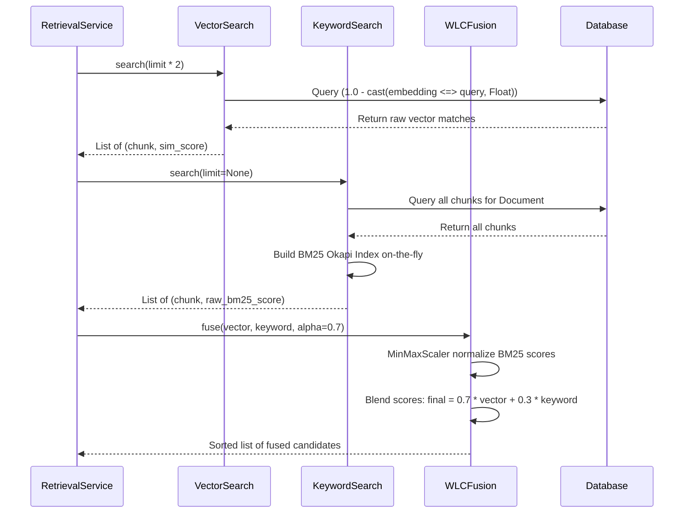

# Phase 6 — Hybrid Retrieval Playbook

This document details the audit, retrofit strategy, and upgraded implementation playbook for executing dense vector and sparse keyword queries in parallel, normalizing BM25 scores, and combining them using a Weighted Linear Combination (WLC) score fusion.

---

## 1. Phase Audit

During the audit of the original Phase 6 roadmap, the following gaps and critical engineering issues were identified:
- **SQLAlchemy pgvector Cast Compilation Error**: In SQLAlchemy, using `(1.0 - DocumentChunk.embedding.op('<=>')(query_embedding))` without an explicit type cast causes a compilation failure. The database layer propagates the custom `Vector` type back into arithmetic operations, leading to SQL type mismatch errors. The actual implementation resolves this by explicitly casting the cosine distance to `Float` using `sqlalchemy.cast(..., Float)`. This was undocumented.
- **Candidate Count Calibration**: The original roadmap suggested running vector and keyword searches with matching limits. The actual implementation in `RetrievalService` retrieves `limit * 2` vector candidates to ensure sufficient semantic coverage, and scores *all* document chunks for BM25 (`limit = None`) to build a comprehensive corpus map on-the-fly.
- **MinMaxScaler division-by-zero**: If all BM25 scores are identical (e.g. no query tokens match any document chunk), the denominator `(max_val - min_val)` becomes zero. The actual implementation implements a default threshold return of `0.0` for all scores and appends a tiny constant $\epsilon = 10^{-6}$ to the denominator to prevent division-by-zero.

---

## 2. Retrofit Strategy

To convert this phase into a reliable engineering execution guide:
1. **Document the SQLAlchemy pgvector Cast Workaround**: Detail `cast(DocumentChunk.embedding.op('<=>')(query_embedding), Float)` to prevent compilation crashes.
2. **Explicitly detail `custom_tokenizer` rules**: Document punctuation regex substitution and stop-word filtering.
3. **Capture the fused combination model**: Map out how chunks retrieved by only one search engine default to a score of `0.0` for the other.

---

## 3. Upgraded Implementation Playbook

### 3.1 Phase Overview
- **Objective**: Retrieve relevant database document chunks by running dense cosine similarity and sparse keyword search (BM25 Okapi) in parallel, merging and ranking results.
- **Purpose**: Combines semantic retrieval with keyword matching (e.g., specific code properties like `server.port`), providing high accuracy on technical documentation.
- **Expected Outcome**: An API controller endpoint returning a single sorted list of fused document chunk matches.
- **Dependencies**: Phase 5 (Python Ingestion Pipeline active).

### 3.2 Prerequisites
- Chunks and embeddings populated in the database.
- SentenceTransformer model running locally.

### 3.3 Environment Configuration
No additional configuration variables are introduced.

### 3.4 Dependencies
Verify `ai-engine/requirements.txt` contains:
- `rank-bm25>=0.2.2` (BM25 scoring library).
- `pgvector>=0.2.0` (Database vector operators).

### 3.5 Implementation Guide

#### Step 1: Implement custom tokenizer (`app/services/search_keyword.py`)
Create a helper function to sanitize corpus strings before indexing:
1. Convert input text to lowercase.
2. Replace all punctuation characters with space using regex `re.sub(f"[{re.escape(string.punctuation)}]", " ", text)`.
3. Split the cleaned string by whitespace.
4. Filter out standard English stop words (e.g. `the`, `and`, `a`).

#### Step 2: Implement pgvector Vector Search (`app/services/search_vector.py`)
Build the database query:
- Target distance operator: `<=>` (Cosine Distance).
- Cast the distance to `Float`:
  ```python
  cosine_distance = cast(DocumentChunk.embedding.op('<=>')(query_embedding), Float)
  ```
- Calculate similarity as: `similarity = 1.0 - cosine_distance`.
- Order by distance ascending, set limits to `limit * 2`, and filter by `document_id`.

#### Step 3: Implement BM25 Keyword Search (`app/services/search_keyword.py`)
Build the in-memory keyword service:
1. Fetch all chunks matching `document_id` sorted by `chunk_index`.
2. Tokenize chunk content arrays using `custom_tokenizer`.
3. Initialize the BM25 index with the corpus: `bm25 = BM25Okapi(corpus)`.
4. Tokenize the user's query and calculate scores: `bm25.get_scores(query_tokens)`.
5. Return a sorted list of `(chunk, float(score))` tuples.

#### Step 4: Implement MinMaxScaler Normalizer (`app/services/fusion.py`)
Expose the normalizer class:
- Inputs: List of raw float scores.
- Formula:
  $$Score_{bm25\_norm} = \frac{Score - Score_{min}}{(Score_{max} - Score_{min}) + 10^{-6}}$$
- Clamp the normalized values strictly to $[0.0, 1.0]$.
- If all raw scores are identical, return a list of `0.0`.

#### Step 5: Implement Weighted Linear Combination Fusion (`app/services/fusion.py`)
Expose `WLCFusion.fuse`:
1. Extract and normalize raw keyword scores using the normalizer.
2. Map chunk IDs to their normalized keyword scores.
3. Map chunk IDs to their vector similarity scores.
4. Loop through the union of all chunk IDs retrieved:
   - Fused Score:
     $$Score_{final} = \alpha \cdot Sim_{vector} + (1.0 - \alpha) \cdot Score_{bm25\_norm}$$
     (where default $\alpha = 0.7$).
5. Sort the merged results in descending order of their fused scores.

#### Step 6: Coordinate Retrieval (`app/services/retrieval.py`)
Write `RetrievalService.retrieve_hybrid`:
1. Compute the query embedding.
2. Fetch `limit * 2` vector search candidates.
3. Fetch all keyword search candidates (`limit = None`).
4. Fuse the results and return the top `limit` items along with the confidence score.

### 3.6 Manual Engineering Work
The developer must run `pip install rank-bm25` inside the Python virtual environment.

### 3.7 Integration Steps
- Connect the FastAPI retrieval service to the database session pool.
- Coordinate input parameters from incoming FastAPI request JSON schemas.

### 3.8 Verification

#### 1. In-Memory Search Verification (Unit Test):
Create a mock corpus containing chunks:
- Chunk A: "Configure the server port property."
- Chunk B: "Database properties include connection pool sizes."
Issue query: `"server port"`.
Verify: Chunk A must yield a higher normalized BM25 score than Chunk B.

#### 2. Vector Cosine Check:
Ensure vector search retrieves chunks sorted by similarity:
```sql
SELECT id, (1.0 - (embedding <=> '[0.1, 0.2, ...]')) AS similarity 
FROM document_chunks 
ORDER BY similarity DESC LIMIT 5;
```



### 3.9 Troubleshooting

#### Issue 1: `TypeError: 'Vector' object is not callable` in SQLAlchemy
- **Symptoms**: Database query crashes when calculating similarity.
- **Root Cause**: The operator syntax is configured incorrectly or missing the cast.
- **Resolution**: Use the exact operator syntax `DocumentChunk.embedding.op('<=>')(query_embedding)` wrapped inside a `sqlalchemy.cast(..., Float)` block.

#### Issue 2: Poor Hybrid Performance on Short Queries
- **Symptoms**: Vector search and BM25 search produce completely disjoint sets of results.
- **Root Cause**: The blend parameter $\alpha$ is too high or too low.
- **Resolution**: Tune the alpha weight. If exact matches (e.g. property keys) are critical, decrease alpha to `0.5` or `0.6` to give keyword search more weight.

### 3.10 Completion Checklist
- [x] Vector search casts pgvector operators to `Float` to prevent ORM compile errors.
- [x] Punctuation and stop words are filtered out by the tokenizer.
- [x] BM25 corpus builds dynamically for each document context.
- [x] MinMaxScaler handles division-by-zero edge cases with epsilon values.
- [x] Fused results are correctly ranked and sorted in descending order.

### 3.11 Lessons Learned
- **Dynamic Corpus Indexing**: Building the BM25 index on-the-fly per document is highly efficient for single-document queries. This design avoids the CPU and memory footprint of maintaining a running Elasticsearch container for local development.
