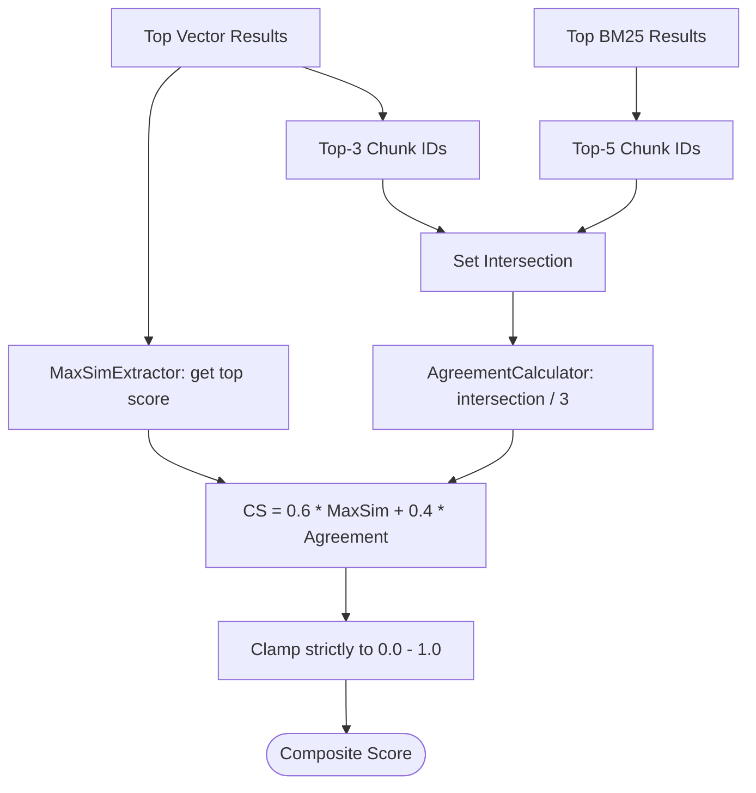

# Phase 7 — Confidence Scoring Playbook

This document details the audit, retrofit strategy, and upgraded implementation playbook for evaluating RAG context retrieval quality using a Composite Confidence Score ($CS$).

---

## 1. Phase Audit

During the audit of the original Phase 7 roadmap, the following gaps were identified:
- **Index Sorting Assumptions**: The original roadmap mentioned extracting `MaxSim` from vector results but did not specify that vector results must be pre-sorted in descending order. The actual implementation in `MaxSimExtractor` utilizes the pre-sorted structure, extracting the first element (`vector_results[0][1]`).
- **Mathematical Boundary Clamping**: The roadmap did not document boundary protection logic. If vector similarities drift outside the range $[0.0, 1.0]$ due to floating-point errors, the final score could exceed boundaries. The actual implementation clamps both `max_sim` and the final `cs` score strictly using `max(0.0, min(1.0, score))`.
- **Handling Empty Result Sets**: The roadmap did not detail how to handle empty vector search results (e.g. when a document has zero chunks). The actual implementation prevents division-by-zero by returning a default `0.0` early.

---

## 2. Retrofit Strategy

To convert this phase into a reliable engineering execution guide:
1. **Highlight early exit states**: Detail how the calculators return `0.0` when results are empty.
2. **Explicitly outline set intersection math**: Document the collection of the top 3 vector chunks and top 5 keyword chunks.
3. **Detail boundary protection**: Show how clamping functions prevent mathematical overflow.

---

## 3. Upgraded Implementation Playbook

### 3.1 Phase Overview
- **Objective**: Implement a scoring module that evaluates retrieval reliability by combining dense vector similarity with sparse search consensus.
- **Purpose**: Computes retrieval certainty to route queries through appropriate fallback recovery tiers (Green, Yellow, Orange, Red).
- **Expected Outcome**: A stateless python calculator that yields confidence values strictly bound within the range $[0.0, 1.0]$.
- **Dependencies**: Phase 6 (Hybrid Retrieval active).

### 3.2 Prerequisites
- Dense vector similarity queries return similarity metrics.
- BM25 keyword rankings return relevance weights.

### 3.3 Environment Configuration
No additional configuration variables are introduced.

### 3.4 Dependencies
- Standard Python libraries (`uuid`, `typing`).
- SQLAlchemy database models.

### 3.5 Implementation Guide

#### Step 1: Implement `MaxSimExtractor` (`app/services/confidence.py`)
1. Extract the cosine similarity score of the first chunk in the pre-sorted vector results:
   ```python
   score = vector_results[0][1]
   ```
2. Clamp the value: `max(0.0, min(1.0, score))`.
3. If `vector_results` is empty, return `0.0`.

#### Step 2: Implement `AgreementCalculator` (`app/services/confidence.py`)
1. Extract the unique database IDs of the top 3 vector matches:
   ```python
   top3_vector_ids = {chunk.id for chunk, _ in vector_results[:3]}
   ```
2. Extract the unique database IDs of the top 5 BM25 keyword matches:
   ```python
   top5_keyword_ids = {chunk.id for chunk, _ in keyword_results[:5]}
   ```
3. If `top3_vector_ids` is empty, return `0.0`.
4. Calculate the intersection count divided by 3:
   $$Agreement = \frac{|Vector_{top3} \cap BM25_{top5}|}{3.0}$$

#### Step 3: Implement `ConfidenceService` (`app/services/confidence.py`)
Expose the composite calculator:
1. Fetch `max_sim` and `agreement`.
2. Compute:
   $$CS = 0.6 \cdot max\_sim + 0.4 \cdot agreement$$
3. Return the clamped result: `max(0.0, min(1.0, cs))`.

### 3.6 Manual Engineering Work
No manual actions are required. The module operates as pure, stateless service logic.

### 3.7 Integration Steps
Verify integration inside `RetrievalService`:
- Call `ConfidenceService.calculate_confidence(vector_results, keyword_results)`.
- Return the resulting score alongside the fused document chunks.

### 3.8 Verification

#### Unit Test Validation:
Write a test script inside `app/tests/test_confidence.py` using `pytest` to assert the following inputs and outputs:

| Scenario | Vector Scores (Top-3) | Keyword Chunk ID Overlaps (Top-5) | Expected MaxSim | Expected Agreement | Expected CS |
| :--- | :--- | :--- | :--- | :--- | :--- |
| **High Match & Consensus** | `[0.85, 0.80, 0.75]` | 3 overlaps (all 3 in top 5) | `0.85` | `1.00` | `0.91` (Green) |
| **High Match, No Consensus** | `[0.90, 0.85, 0.80]` | 0 overlaps | `0.90` | `0.00` | `0.54` (Yellow) |
| **Weak Match, High Consensus**| `[0.40, 0.38, 0.35]` | 3 overlaps | `0.40` | `1.00` | `0.64` (Yellow) |
| **No Retrieval Match** | `[]` | 0 overlaps | `0.00` | `0.00` | `0.00` (Red) |



### 3.9 Troubleshooting

#### Issue 1: Floating Point Overflows
- **Symptoms**: Output confidence scores return values like `1.0000002`, breaking strict database validation rules.
- **Root Cause**: Python's floating-point representation accumulates small precision offsets.
- **Resolution**: Use the boundary protection clamp wrapper `max(0.0, min(1.0, value))` at both intermediate extraction levels and final returns.

### 3.10 Completion Checklist
- [x] `MaxSimExtractor` handles empty vector search lists without throwing index errors.
- [x] `AgreementCalculator` retrieves top-3 and top-5 slice IDs correctly.
- [x] Set intersections normalize by dividing by `3.0`.
- [x] Final scoring output is clamped to the range $[0.0, 1.0]$.
- [x] Boundary unit tests execute and pass successfully.

### 3.11 Lessons Learned
- **Combining Dense and Sparse Signals**: Relying strictly on vector similarity can lead to false positives (high MaxSim on irrelevant text). Combining it with BM25 keyword overlap (Agreement) acts as a reliable filter for technical documentation accuracy.
