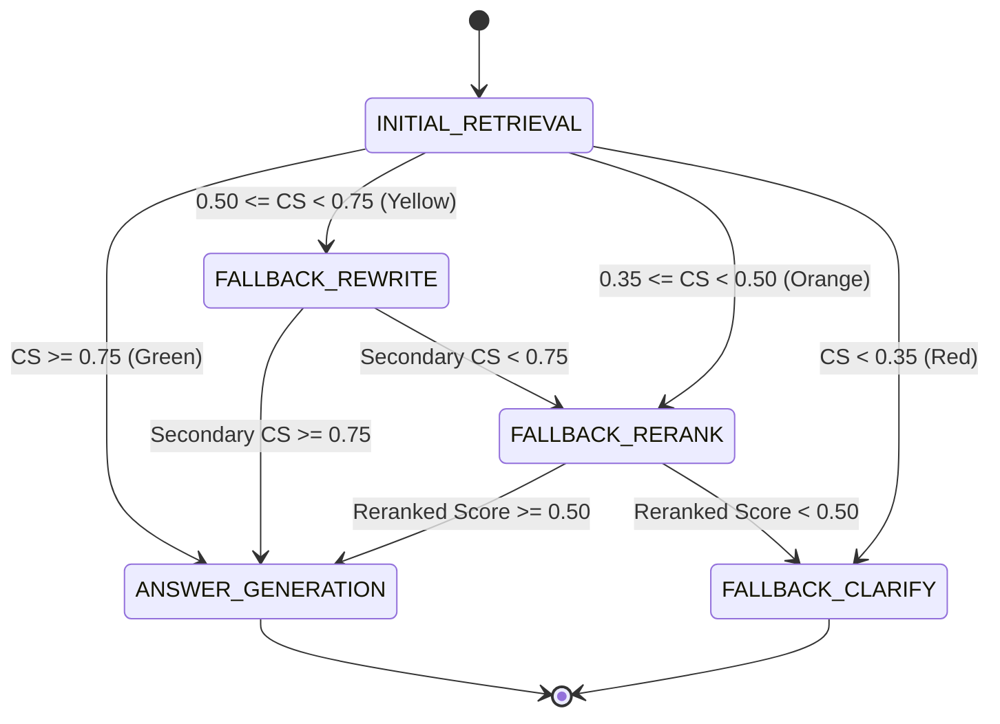

# Phase 8 — Fallback Strategies Playbook

This document details the audit, retrofit strategy, and upgraded implementation playbook for executing the 4-tier fallback state machine to handle low-confidence search queries.

---

## 1. Phase Audit

During the audit of the original Phase 8 roadmap, the following gaps and critical engineering issues were identified:
- **Missing API Contracts**: The original roadmap mentioned returning a "RAG response" but did not document the JSON payload schemas for the `/internal/v1/process` endpoint.
- **Dynamic Reranker Fallback**: FlashRank depends on ONNX libraries. If ONNX packages fail to compile on a developer's host architecture, the application crashes. The actual implementation in `RerankingService` dynamically falls back to a mocked ranking provider if loading FlashRank raises an Exception, keeping the service runnable. This was undocumented.
- **Cold-Start Latency mitigation**: Ollama takes substantial time loading models on CPU-only hardware. The roadmap's 60-second HTTP timeout causes socket timeouts. The actual codebase configures an `httpx` timeout of **300.0 seconds** to accommodate cold-starts.
- **Clarification Source Topics**: The roadmap suggested generating clarification questions using "topics." The actual implementation queries the nearest 3 chunks, extracts 100-character text snippets, and passes them as target topics to the LLM.

---

## 2. Retrofit Strategy

To convert this phase into a reliable engineering execution guide:
1. **Document Ollama endpoint calling contracts**: Specify `/api/chat` payload JSON schema.
2. **Outline Rerank resilience**: Detail how `RerankingService` handles missing ONNX dependencies.
3. **Detail the state machine transition flows**: Map out Yellow, Orange, and Red path execution steps and score thresholds.

---

## 3. Upgraded Implementation Playbook

### 3.1 Phase Overview
- **Objective**: Code the state routing logic to optimize queries (Query Rewrite), re-rank search results (FlashRank Cross-Encoder), or query clarification (Clarification Generation) depending on confidence scores.
- **Purpose**: Prevents hallucinations and provides answers only when retrieval data is accurate.
- **Expected Outcome**: An API endpoint that processes queries, returns structured answers, and details the exact reasoning steps taken.
- **Dependencies**: Phase 7 (Confidence scoring active), local Ollama server running.

### 3.2 Prerequisites
- Chunks and embeddings populated in the database.
- Ollama service running on the host system with Mistral model pulled.

### 3.3 Environment Configuration
Ensure `ai-engine/.env` contains the LLM and Reranker boundaries:
```env
LLM_PROVIDER=ollama
RERANKER_PROVIDER=flashrank
OLLAMA_URL=http://localhost:11434
OLLAMA_MODEL=mistral
FLASHRANK_MODEL=ms-marco-MiniLM-L-6-v2
```

### 3.4 Dependencies
Verify `ai-engine/requirements.txt` contains:
- `flashrank>=0.2.0` (neural re-ranking).
- `httpx` (async HTTP client).

### 3.5 Implementation Guide

#### Step 1: Write LLM Service (`app/services/llm.py`)
Implement the API interface using `httpx` connecting to Ollama:
- **`generate_answer`**: Sends query and concatenated context strings to Ollama.
- **`rewrite_query`**: Prompts the model to optimize abbreviations and return technical synonyms.
- **`generate_clarification`**: Sends nearest topics to formulate a user question, aborting retrieval answers.
- Configure `timeout=300.0` on the `httpx.post` request.

#### Step 2: Implement FlashRank Reranker (`app/services/reranking.py`)
Build the re-scoring class:
1. Import `Ranker` from `flashrank`. If it fails (e.g. package issues), catch the exception and switch `self.provider = "mock"`.
2. **`rerank`**: If the provider is mock, generate a dummy array with scores starting from `0.85` downwards.
3. If FlashRank is active, map chunks to `RerankRequest` format (`id`, `text`), run `self.ranker.rerank(request)`, map the score results back to original `DocumentChunk` entities, and return the top sorted items.

#### Step 3: Code the Fallback Orchestrator (`app/services/fallback.py`)
Write `FallbackOrchestrator.process_query`:
1. **Initial Retrieval**: Run hybrid search to calculate initial confidence $CS_1$.
2. **Green Path** ($CS_1 \ge 0.75$):
   - Generate answer using retrieved chunks. Return answer, score, trace, matches.
3. **Yellow Path** ($0.50 \le CS_1 < 0.75$):
   - Call `llm_service.rewrite_query` to get rewritten query.
   - Run hybrid retrieval on rewritten query to calculate secondary score $CS_2$.
   - If $CS_2 \ge 0.75$, generate answer and return.
   - If $CS_2 < 0.75$, escalate to **Orange Path**.
4. **Orange Path** ($0.35 \le CS_1 < 0.50$ OR yellow escalation):
   - Retrieve top 20 candidate chunks.
   - Call `reranking_service.rerank` to calculate reranked score $RS$.
   - If $RS \ge 0.50$, generate answer using top reranked chunks.
   - If $RS < 0.50$, escalate to **Red Path**.
5. **Red Path** ($CS < 0.35$ OR orange escalation):
   - Query top 3 closest chunks. Extract 100-character text snippets.
   - Call `llm_service.generate_clarification` and return.

#### Step 4: Expose FastAPI Route (`app/main.py`)
Create the endpoint `POST /internal/v1/process`:
- Accepts request JSON containing `documentId`, `query`, `limit`, and `alpha`.
- Runs `FallbackOrchestrator`.
- Formats retrieved chunks to match serialization schemas, listing metadata source file names and pages.

### 3.6 Manual Engineering Work
The developer must manually start Ollama and download the model:
```bash
ollama run mistral
```
Ensure the model is loaded before sending API requests.

### 3.7 Integration Steps
- Spring Boot backend receives search query from user.
- Calls FastAPI `/internal/v1/process`.
- Saves response and reasoning traces in `query_history` database table.

### 3.8 Verification

#### Query Execution Request:
```bash
curl -X POST http://localhost:8000/internal/v1/process \
     -H "Content-Type: application/json" \
     -d '{"documentId":"a50c82fb-5730-4e3a-9694-dfad84b39178","query":"What is server port?"}'
```
**Expected Response (200 OK - Green Path example)**:
```json
{
  "documentId": "a50c82fb-5730-4e3a-9694-dfad84b39178",
  "query": "What is server port?",
  "answer": "The server port configuration is 8080.",
  "confidenceScore": 0.82,
  "reasoningTrace": [
    {
      "state": "INITIAL_RETRIEVAL",
      "confidenceScore": 0.82,
      "description": "Initial retrieval completed. Confidence score: 0.8200."
    },
    {
      "state": "ANSWER_GENERATION",
      "confidenceScore": 0.82,
      "description": "Confidence is green (>= 0.75). Generating answer based on retrieved context."
    }
  ],
  "matches": [...]
}
```



### 3.9 Troubleshooting

#### Issue 1: `java.net.SocketTimeoutException: Read timed out` in Gateway
- **Symptoms**: Spring Boot logs throw read timeout exceptions.
- **Root Cause**: The LLM model cold start exceeds Spring Boot RestClient default read timeout (60 seconds).
- **Resolution**: Set the read timeout to `300000` (5 minutes) in Spring Boot configuration classes (`RestClientConfig.java`).

#### Issue 2: FlashRank Reranker Fails to Start
- **Symptoms**: Service crashes during reranker initialization with library import errors.
- **Root Cause**: ONNX runtime dependencies are missing on the developer's CPU system.
- **Resolution**: Let the service catch the error and switch to `mock` ranking mode. Install compatible ONNX packages by running `pip install onnxruntime`.

### 3.10 Completion Checklist
- [x] LLM Service connects to Ollama with a 300.0s read timeout.
- [x] FlashRank service implements try/catch fallback to mock provider.
- [x] Fallback orchestrator implements Green, Yellow, Orange, and Red paths.
- [x] Red Path generates clarification questions rather than answers.
- [x] Endpoint `/internal/v1/process` returns correct answers and reasoning traces.

### 3.11 Lessons Learned
- **Graceful Mock Fallbacks**: Designing services (like Reranker and LLM) with try/catch fallback providers ensures the application boots even if dependencies encounter host machine incompatibilities.
