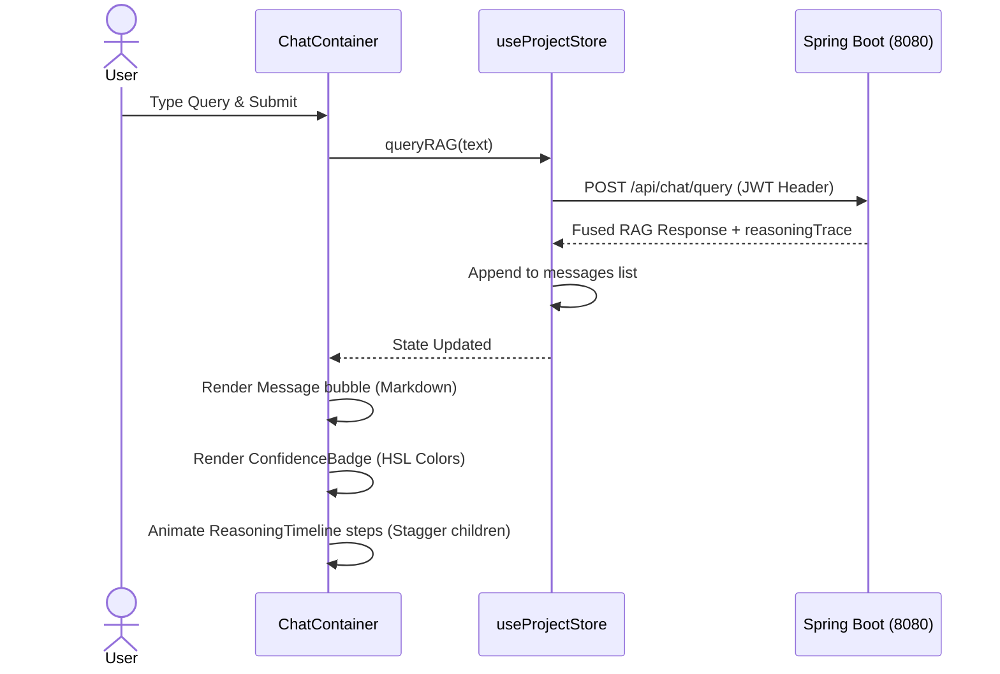

# Phase 9 — React Frontend Playbook

This document details the audit, retrofit strategy, and upgraded implementation playbook for developing the React user interface, document upload vault, and RAG chat panel with citations and reasoning timelines.

---

## 1. Phase Audit

During the audit of the original Phase 9 roadmap, the following gaps were identified:
- **Incorrect Folder Context**: The roadmap listed directory names as `phoenix-frontend/` instead of `frontend/`.
- **Reasoning Timeline States Mismatch**: The original roadmap mentioned animating timeline nodes but did not document the exact mapping properties that match the backend response keys (e.g., mapping `INITIAL_RETRIEVAL` to blue, `FALLBACK_REWRITE` to amber, `FALLBACK_RERANK` to orange, and `ANSWER_GENERATION` to emerald).
- **Citations Click-Highlight Hook**: The roadmap outlined linking markdown citation tags (`[p.12 - Source]`) to the Citation Matrix sidebar but omitted detailing the scroll-into-view behavior, which requires coordinate offsets in standard CSS scroll actions to prevent headers from obscuring active cards.

---

## 2. Retrofit Strategy

To convert this phase into a reliable engineering execution guide:
1. **Document Zustand Store implementations**: Detail state properties for auth and project managers.
2. **Provide styling mappings for the Timeline**: Detail the Tailwind classes (`bg-emerald-500/10 border-emerald-500/30 text-emerald-400`, etc.) mapping to each RAG pipeline state.
3. **Detail interactive citation highlighting**: Explain how DOM element selection handles citation clicks.

---

## 3. Upgraded Implementation Playbook

### 3.1 Phase Overview
- **Objective**: Build the user console interface containing a project dashboard, file uploader vault, markdown chat window, and reasoning trace panel.
- **Purpose**: Exposes the capabilities of the database, security gateway, and AI engine in a premium, visual cockpit.
- **Expected Outcome**: A single-page application built on Vite that provides secure project workspaces, real-time file upload status tracking, and explainable RAG responses.
- **Dependencies**: Phase 2 (JWT Auth) and Phase 4 (Upload endpoints) operational.

### 3.2 Prerequisites
- Node.js environment v20+ with npm v10+.
- Gateway backend running on port 8080.
- AI engine active on port 8000.

### 3.3 Environment Configuration
Create `frontend/.env` to configure client routing:
```env
VITE_BACKEND_URL=http://localhost:8080/api
```

### 3.4 Dependencies
Verify `frontend/package.json` contains:
- `react` & `react-dom` (v19).
- `zustand` (State management).
- `framer-motion` (Reasoning timeline transitions).
- `react-markdown` (Chat bubble text processor).
- `tailwindcss` & `autoprefixer` (styling layouts).

### 3.5 Implementation Guide

#### Step 1: Implement `useAuthStore` (`src/store/useAuthStore.js`)
Build authentication storage using Zustand:
- Manage properties: `token` (stored in `localStorage`), `user`, `isAuthenticated`, `error`.
- Implement async methods: `login(email, password)` and `register(email, username, password, fullName)`. Save the returned token on success.
- Implement `logout()` (purges localStorage and redirects).

#### Step 2: Implement `useProjectStore` (`src/store/useProjectStore.js`)
Create the core workspace state manager:
- State fields: `projects`, `activeProject`, `documents`, `messages`, `activeDocument`, `isQuerying`.
- Methods:
  - `fetchProjects()`: Calls `/api/projects` injecting JWT token in Headers.
  - `createProject(name)`: Issues POST request to `/api/projects`.
  - `fetchDocuments(projectId)`: Refreshes document lists.
  - `uploadFile(file, projectId)`: Issues multipart form upload. Starts interval polling to check `/api/documents/{id}/status` until status transitions to `READY` or `FAILED`.
  - `queryRAG(query)`: Sends search query to `/api/chat/query`, appending returned answers and `reasoningTrace` metadata to the message list.

#### Step 3: Write Dashboard Shell Layout (`src/components/Layout.jsx`)
Expose a layout containing:
- Sidebar: Listing project links, logout triggers, and a create project modal.
- Active Workspace Window: Split views showing a Vault dashboard or Chat interface.

#### Step 4: Develop Document Vault Upload Component (`src/components/Vault/`)
1. **`UploadZone.jsx`**: Implement drag-and-drop triggers. When file drops, invoke `uploadFile` inside the project store, displaying progress loaders.
2. **`VaultDashboard.jsx`**: Display files with status badges. Files with `READY` state display chunk counts.

#### Step 5: Build RAG Chat Workspace (`src/components/Chat/`)
1. **`ChatContainer.jsx`**: Renders message histories. On RAG queries, triggers loading animations.
2. **`MessageBubble.jsx`**: Uses `react-markdown` to format text. Customizes links containing source indexes (e.g. `[1]`, `[2]`). If the sender is the assistant, displays a color-coded `ConfidenceBadge` and the `ReasoningTimeline`.
3. **`ReasoningTimeline.jsx`**: Receives `steps` trace arrays and renders sequential list items:
   - `INITIAL_RETRIEVAL`: Blue (`bg-blue-500/10 border-blue-500/30 text-blue-400`).
   - `FALLBACK_REWRITE`: Amber (`bg-amber-500/10 border-amber-500/30 text-amber-400`).
   - `FALLBACK_RERANK`/`RERANK_EVALUATION`: Orange (`bg-orange-500/10 border-orange-500/30 text-orange-400`).
   - `FALLBACK_CLARIFY`/`CLARIFICATION_GENERATION`: Red (`bg-red-500/10 border-red-500/30 text-red-400`).
   - `ANSWER_GENERATION`: Emerald (`bg-emerald-500/10 border-emerald-500/30 text-emerald-400`).
   - Animate children using Framer Motion stagger transitions.
4. **`CitationMatrix.jsx`**: Displays details for retrieved source chunks (source filename, page number, raw text snippet). When a user clicks a citation link in the bubble, scroll the citation card into view using `scrollIntoView({ behavior: 'smooth', block: 'nearest' })` and apply a temporary highlight animation.

### 3.6 Manual Engineering Work
The developer must initialize the project folder structure, write general styling inside `src/index.css` using Tailwind directives (`@tailwind base;`, etc.), and verify that local web assets render correctly.

### 3.7 Integration Steps
Verify proxy handoffs:
- Outbound requests starting with `/api/` are forwarded by the Vite dev server directly to `http://localhost:8080`.
- Verify that request interceptors automatically attach the `Authorization: Bearer <token>` header to all outgoing requests.

### 3.8 Verification

#### Interactive Verification Checklist:
1. **Login Validation**: Open `http://localhost:5173`. Confirm redirect to registration/login forms.
2. **Vault Upload Validation**: Upload a PDF. Status changes: `PROCESSING` (rotating spinner) $\to$ `READY` (chunk count appears).
3. **RAG Query Execution**: Type technical query. Reasoning trace dropdown appears, showing confidence and step descriptions.
4. **Interactive Citations**: Click citation tag in AI message bubble. Confirm right-hand citation card scrolls into focus and glows.



### 3.9 Troubleshooting

#### Issue 1: Missing JWT Headers on Outbound Requests
- **Symptoms**: UI requests return `401 Unauthorized` after login.
- **Root Cause**: The request helper does not retrieve the JWT token from `localStorage` or fails to append the bearer prefix.
- **Resolution**: Verify that the fetch header configuration contains `'Authorization': 'Bearer ' + token` before issuing requests.

#### Issue 2: Markdown Citation Links Break Renders
- **Symptoms**: Citation highlights do not highlight, or clicking them triggers navigation crashes.
- **Root Cause**: Custom markdown renderers treat citations as standard anchor URLs.
- **Resolution**: Intercept markdown `a` tags in the parser. If the href begins with `#citation-`, prevent default behavior and scroll to the target DOM ID manually.

### 3.10 Completion Checklist
- [x] Zustand stores manage tokens and cache workspace states.
- [x] File uploads poll backend status endpoints sequentially.
- [x] Markdown text parsing displays technical snippets correctly.
- [x] Citation tags link to elements in the Citation Matrix.
- [x] Reasoning timeline animations expand and display step metadata.
- [x] Color-coded badges accurately reflect the 4-tier confidence intervals.

### 3.11 Lessons Learned
- **Centralized State Coordination**: Using Zustand for state management keeps components decoupled and makes the dashboard shell, vault tables, and chat widgets easy to coordinate.
