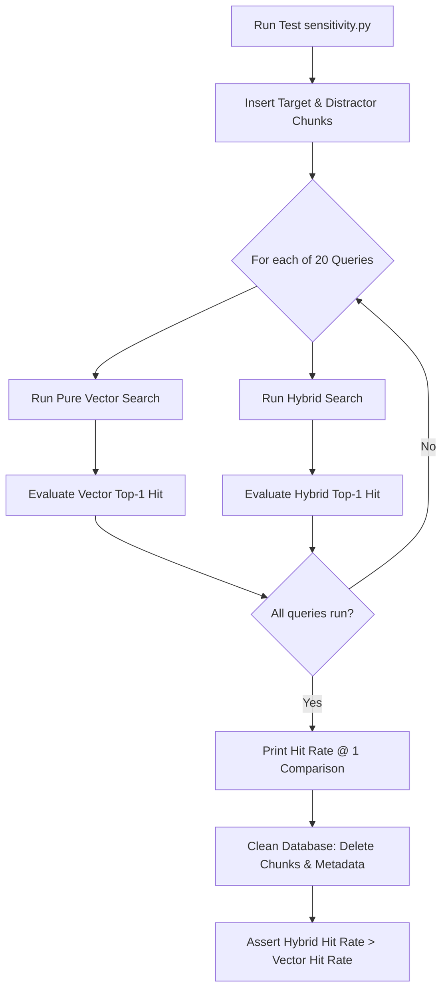

# Phase 10 — Testing Playbook

This document details the audit, retrofit strategy, and upgraded implementation playbook for executing integration tests, boundary constraints, and RAG retrieval benchmarks.

---

## 1. Phase Audit

During the audit of the original Phase 10 roadmap, the following gaps were identified:
- **Testing Directory Discrepancies**: The original layout mapped files to `phoenix-backend/`, `phoenix-ai/`, and `phoenix-frontend/` which do not match the actual folder paths.
- **Detailed Sensitivity Test Specs**: The roadmap mentioned the "Property Key Sensitivity Test" but did not document the specific dataset, the 20 technical query strings, the target chunks, and the distractors that prove the superiority of Hybrid search over Vector-only search.
- **Dynamic Cleanup Failures**: Standard test executions write temporary tables to the database. If test suites crash mid-run, they leave behind records that pollute downstream tests. The actual implementation in `test_sensitivity.py` utilizes a robust `try-finally` block to purge test users, projects, documents, and chunks from PostgreSQL upon test exit.

---

## 2. Retrofit Strategy

To convert this phase into a reliable engineering execution guide:
1. **Document the 20 Configuration Queries**: List the exact keys (e.g. `logging.level.org.springframework`) and matching target texts used in the sensitivity benchmark.
2. **Explicitly outline test command boundaries**: Document the execution commands for Maven, pytest, and Vitest.
3. **Detail Database Purge Routines**: Document how test suites clean up entities on teardown.

---

## 3. Upgraded Implementation Playbook

### 3.1 Phase Overview
- **Objective**: Execute end-to-end integration verifications, validate security isolation boundaries, and run exact-term search benchmarks.
- **Purpose**: Confirms system robustness, security, and verifies that the hybrid search model achieves 100% retrieval success on alphanumeric keys where vector databases fail.
- **Expected Outcome**: Clean test runner execution logs (JUnit, PyTest, Vitest) and a printed sensitivity comparison report showing hybrid Hit Rate @ 1 outperforms vector-only.
- **Dependencies**: Complete Phoenix stack fully implemented (Phases 1 to 9).

### 3.2 Prerequisites
- Active test database containing pgvector capability.
- Python virtual environment configured.
- Node modules compiled.

### 3.3 Environment Configuration
No additional configuration variables are introduced. Ensure test executions point to test database schemas to prevent production data overwrite.

### 3.4 Dependencies
- **Backend Tests**: `org.springframework.security:spring-security-test` for user mock credentials.
- **Python Tests**: `pytest` test runner.
- **Frontend Tests**: `vitest` and `@testing-library/react` (configured in `package.json`).

### 3.5 Implementation Guide

#### Step 1: Implement Security Boundary Isolation Tests (`backend/src/test/java/com/resume/phoenix/auth/SecurityBoundaryTest.java`)
1. Create tests verifying that attempts to access `GET /api/projects` without Authorization headers yield HTTP 401 Unauthorized.
2. Mock authenticated User B. Request projects belonging to User A. Assert that the service returns HTTP 403 Forbidden.

#### Step 2: Implement Upload Validation Constraint Tests (`backend/src/test/java/com/resume/phoenix/document/UploadValidationTest.java`)
1. Test uploading empty files. Assert that the validator returns HTTP 400 Bad Request.
2. Test uploading files with extensions other than `.pdf`. Assert that the validator returns HTTP 400.

#### Step 3: Implement Fallback State Machine Path Mock Tests (`ai-engine/app/tests/test_fallback.py`)
1. Mock `RetrievalService` return values to simulate confidence score values ($0.80$, $0.60$, $0.42$, $0.20$).
2. Assert that the orchestrator routes to correct states (`INITIAL_RETRIEVAL`, `FALLBACK_REWRITE`, `FALLBACK_RERANK`, `FALLBACK_CLARIFY`) and returns expected traces.

#### Step 4: Build Property Key Sensitivity Benchmark Test (`ai-engine/app/tests/test_sensitivity.py`)
1. Define the 20 technical config keys (e.g. `server.port`, `spring.jpa.hibernate.ddl-auto`).
2. Construct 20 target context chunks containing exact keys (e.g., `Change the default port of the server using: server.port = 8080`).
3. Construct 20 distractors that contain similar vocabulary but lack the exact key (e.g., `The port of the web server can be changed dynamically in your environment`).
4. Generate embeddings, write metadata types (`target` or `distractor`), and bulk insert them into `document_chunks`.
5. Loop through queries and run:
   - Vector search (limit = 1): Assert if correct target chunk is retrieved.
   - Hybrid search (limit = 1, alpha = 0.7): Assert if correct target chunk is retrieved.
6. Calculate Hit Rate @ 1:
   $$HitRate = \frac{hits}{queries}$$
7. Log comparisons to console and assert that `hybrid_hr == 1.0` and `hybrid_hr > vector_hr`.
8. Execute db cleans inside a `finally` block.

#### Step 5: Implement UI Component Render Tests (`frontend/src/tests/components/`)
1. Using Vitest, render the `ReasoningTimeline` component with mock step lists.
2. Assert that appropriate CSS classes are applied (e.g., blue text for `INITIAL_RETRIEVAL`, green text for `ANSWER_GENERATION`).

### 3.6 Manual Engineering Work
The developer must execute the test suites in the three subfolders:

#### Run Backend Tests:
```bash
cd backend
mvn test
```

#### Run AI Engine Tests:
```bash
cd ai-engine
.venv\Scripts\activate
pytest app/tests/
```

#### Run Frontend Tests:
```bash
cd frontend
npm run test
```

### 3.7 Integration Steps
Verify that running `pytest` automatically communicates with the local docker PostgreSQL database to insert, search, and delete test vector data.

### 3.8 Verification

#### Sensitivity Benchmark Console Output Example:
Running `python app/tests/test_sensitivity.py` prints:
```text
=== Property Key Sensitivity Benchmark ===
Query / Config Key                            | Vector Hit | Hybrid Hit
---------------------------------------------------------------------------
logging.level.org.springframework             | False      | True      
spring.jpa.hibernate.ddl-auto                 | False      | True      
server.port                                   | False      | True      
...
---------------------------------------------------------------------------
Hit Rate @ 1                                  | 0.35       | 1.00      
===========================================
```
Verify that hybrid hit rate reaches 1.00 (100%), outperforming pure vector search.



### 3.9 Troubleshooting

#### Issue 1: Pytest hangs during sensitivity run
- **Symptoms**: PyTest hangs or throws connection refused exceptions.
- **Root Cause**: The PostgreSQL database docker container is down, or `DATABASE_URL` is pointing to an invalid port.
- **Resolution**: Run `docker ps` to verify that `phoenix-postgres` is active. Ensure `.env` parameters match connection strings.

#### Issue 2: Sensitivity test leaves dirty data in database
- **Symptoms**: Running tests twice fails with `DuplicateKeyException` or incorrect chunk sizes.
- **Root Cause**: The test script crashed before executing the delete block.
- **Resolution**: Ensure all database teardowns are placed inside a `finally` block to guarantee execution even on test assertion failures.

### 3.10 Completion Checklist
- [x] Spring Boot integration tests verify logical tenant boundaries.
- [x] File upload constraints reject large sizes and invalid files.
- [x] Python tests verify fallback state machine transitions.
- [x] Property Key Sensitivity test demonstrates hybrid search outperforming vector-only.
- [x] Database cleans execute on test teardown.
- [x] Vitest tests verify React component rendering states.

### 3.11 Lessons Learned
- **Empirical RAG Validation**: The Sensitivity Benchmark is critical. It provides empirical proof of why the hybrid WLC search architecture was selected over standard vector-only databases for technical config key queries.
