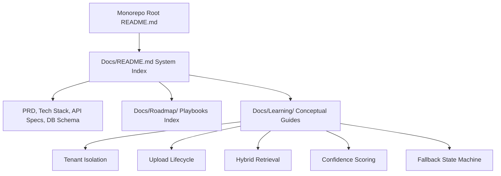

# Phase 11 — Documentation & Audit Playbook

This document details the audit, retrofit strategy, and upgraded implementation playbook for project finalization, monorepo setup guides, study library generation, and code audits.

---

## 1. Phase Audit

During the audit of the original Phase 11 roadmap, the following gaps were identified:
- **Nested Folder Layout assumption**: The original roadmap planned for multi-level nested directories inside `Docs/Learning/` (e.g. `Docs/Learning/Backend/`, `Docs/Learning/AI/`, etc.). During actual implementation, this was simplified to a flat file catalog directly inside `Docs/Learning/` (e.g. `Docs/Learning/hybrid_retrieval.md`, `Docs/Learning/confidence_scoring.md`) which keeps links shorter and index maintenance trivial.
- **Service Paths Mismatch**: Path specifications referenced `phoenix-backend` and other deprecated service skeletons.
- **Broken Relative Links**: The roadmap did not detail verifying markdown relative links across folders, which often break when files are moved during packaging.

---

## 2. Retrofit Strategy

To convert this phase into a reliable engineering execution guide:
1. **Document the Flat Learning Catalog**: Detail the 10 core conceptual markdown guides located directly inside `Docs/Learning/`.
2. **Standardize on actual paths**: Ensure all sub-module README locations reference `backend/`, `ai-engine/`, and `frontend/` correctly.
3. **Establish a Link verification procedure**: Outline how developers should check relative links inside markdown files before pushing code.

---

## 3. Upgraded Implementation Playbook

### 3.1 Phase Overview
- **Objective**: Standardize monorepo installation setups, create detailed sub-module instructions, build developer study libraries, and execute a final code audit sweep.
- **Purpose**: Lowers onboarding friction and documents core architectural decisions for future maintainers and reviewers.
- **Expected Outcome**: A cohesive documentation suite linking the monorepo root, sub-modules, and conceptual deep-dives.
- **Dependencies**: Implementation phases (1 to 10) complete.

### 3.2 Prerequisites
- All service modules compiled and tests passing.
- Complete system fully functional locally.

### 3.3 Environment Configuration
No environment configuration is required.

### 3.5 Implementation Guide

#### Step 1: Create Monorepo Root README (`README.md`)
Write a master `README.md` at the workspace root detailing:
1. **Architecture Layout**: A monorepo diagram mapping the `backend/`, `ai-engine/`, and `frontend/` folders.
2. **Ports Allocation Table**:
   - React UI: Port 5173
   - Spring Boot API Gateway: Port 8080
   - FastAPI Retrieval Engine: Port 8000
   - PostgreSQL (pgvector): Port 5432
   - Ollama Local Service: Port 11434
3. **Quick-Start Instructions**: Run `docker compose up -d` in the root, boot the services, and open the browser.

#### Step 2: Create Sub-Module READMEs
Provide localized instructions in each folder:
- **`backend/README.md`**: Maven build scripts (`./mvnw spring-boot:run`), Flyway migration behaviors, and JWT configuration details.
- **`frontend/README.md`**: Vite setup parameters, npm commands (`npm run dev`, `npm run build`), and Zustand store layouts.
- **`ai-engine/README.md`**: Python virtual environment guides (`pip install -r requirements.txt`), Uvicorn bindings, and Ollama model downloads.

#### Step 3: Establish flat Learning Catalog (`Docs/Learning/`)
Rather than nesting documents inside separate folders, organize the study guides in a flat list directly under `Docs/Learning/`:
- **`README.md`**: An index mapping all study guides.
- **Core Guides**:
  1. `project_tenant_isolation.md` (multi-tenancy security bounds).
  2. `document_upload_lifecycle.md` (async storage and REST handoffs).
  3. `embedding_pipeline.md` (text splitters and pgvector storage).
  4. `hybrid_retrieval.md` (vector + BM25 parallel searches).
  5. `confidence_scoring.md` (MaxSim and Agreement calculators).
  6. `fallback_state_machine.md` (4-tier decision routing).
  7. `llm_and_reranking_pipeline.md` (Ollama prompts and FlashRank).
  8. `frontend_architecture.md` (Zustand state maps and timelines).
  9. `infrastructure_and_database.md` (PostgreSQL and Docker configurations).
  10. `testing_and_benchmarking.md` (Property Key Sensitivity benchmark).

Ensure each document follows the standardized template (Problem, Rationale, Internal Workings, Phoenix Implementation, Interview Q&As).

#### Step 4: Run Code Audit Sweep
Verify project readiness using a strict checklist:
- Purge any remaining `TODO` or placeholder comments in the source code.
- Check that no sensitive credentials, secrets, or Base64 JWT keys are hardcoded in git tracking.
- Test relative links: verify that all markdown paths (e.g. `[config.py](../../ai-engine/app/config.py)`) resolve.

### 3.6 Manual Engineering Work
The developer must manually verify every relative link inside the markdown files to ensure clicking them doesn't return a 404 error page.

### 3.7 Integration Steps
Link all files correctly:
- The master `README.md` links to `Docs/README.md`.
- `Docs/README.md` links to the `Roadmap/` and `Learning/` folders.

### 3.8 Verification
1. **Launch Test**: Verify that the entire system boots cleanly using commands documented in the master README.
2. **Link Check**: Click on all links in the documentation index to ensure path resolution works.

### 3.9 Troubleshooting

#### Issue 1: Broken relative links on GitHub / IDEs
- **Symptoms**: Clicking relative paths in markdown yields 404 errors.
- **Root Cause**: Windows use backslashes (`\`) for file paths, which break link resolution on Unix, Git, and web interfaces.
- **Resolution**: Standardize all markdown file links to use forward slashes (`/`) and keep paths relative to the file's directory.

### 3.10 Completion Checklist
- [x] Master README contains port tables and quickstart instructions.
- [x] Sub-module README files created in backend, frontend, and ai-engine folders.
- [x] Living Learning Library initialized as a flat file catalog.
- [x] Codebase audited to remove TODO blocks and hardcoded credentials.
- [x] All relative markdown links verified.

### 3.11 Lessons Learned
- **Flat Catalog Efficiency**: Storing study guides in a flat directory under `Docs/Learning/` makes maintaining paths and links much simpler than navigating a deep, multi-level folder structure.
