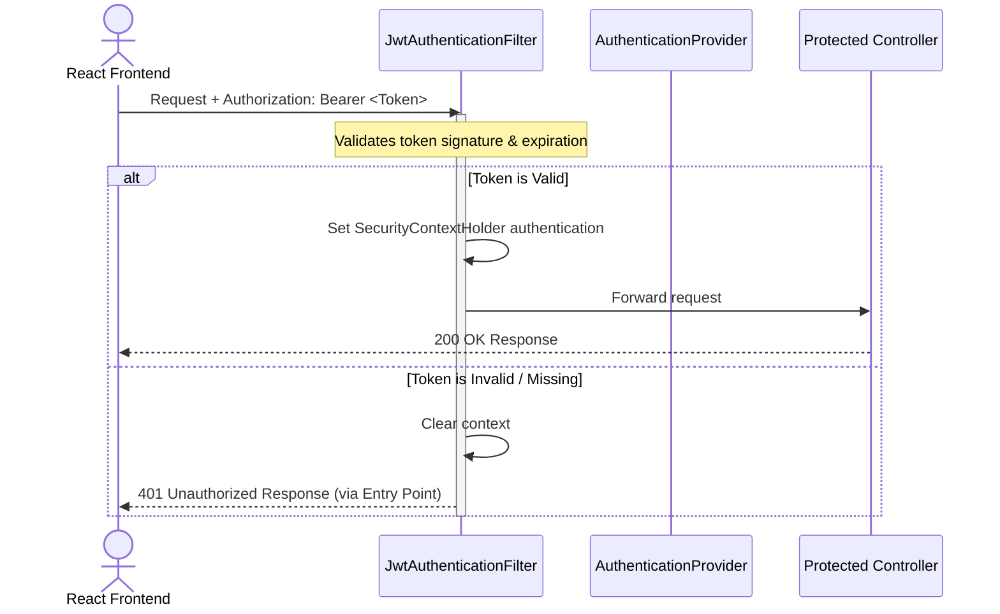

# Security Architecture Specification: Phoenix

This document details the security principles, cryptographic configurations, authorization rules, and attack mitigations implemented in **Phoenix**.

---

## 1. Authentication & Session Management

Phoenix enforces stateless access token security to protect user resources and API endpoints.



### 1.1 Stateless JWT Architecture
* **Algorithm**: HMAC-SHA256 (HS256) used to sign all JSON Web Tokens.
* **Token Structure**: Standard three-part token (`Header.Payload.Signature`) containing:
  * Subject (`sub`): The authenticated `username` (resolved to resolve identity widgets).
  * Expiration time (`exp`): Bounded validation lifespan.
* **Secret Key Injection**: Read from the environment variable `JWT_SECRET_KEY` during boot. If missing or weak, the context raises an exception.
* **Storage on Client**: The JWT is managed in memory/Zustand state on the client to mitigate Cross-Site Scripting (XSS) risks.

### 1.2 Password Cryptography
* **Hashing Algorithm**: BCrypt (salted, 12 rounds of computational work).
* **Execution**: Passwords are encrypted on account creation and registration (`POST /api/auth/register`) before persisting to PostgreSQL. Credentials verified dynamically on login (`POST /api/auth/login`) using Spring Security's `DaoAuthenticationProvider`.

---

## 2. API Authorization & Access Rules

All requests pass through the Spring Security Filter Chain configured in [SecurityConfig.java](../backend/src/main/java/com/resume/phoenix/auth/config/SecurityConfig.java):

```java
http
    .csrf(AbstractHttpConfigurer::disable)
    .cors(cors -> cors.configurationSource(corsConfigurationSource()))
    .authorizeHttpRequests(auth -> auth
            .requestMatchers("/api/auth/**").permitAll()
            .anyRequest().authenticated()
    )
```

* **Permitted Routes**: `/api/auth/**` (allowing `/register` and `/login` requests without tokens).
* **Protected Routes**: `/api/projects/**`, `/api/documents/**`, and `/api/chat/**` require a valid JWT. Requests without a valid Bearer token are blocked at the filter level and return an HTTP `401 Unauthorized` response via `JwtAuthenticationEntryPoint`.
* **CORS Policy**: The backend restricts cross-origin request options:
  * Allowed Origin: `http://localhost:5173` (React Vite local dev client).
  * Allowed Methods: `GET`, `POST`, `PUT`, `DELETE`, `OPTIONS`, `PATCH`.
  * Allowed Headers: `Authorization`, `Content-Type`, `Cache-Control`, `Accept`.
  * Credentials: `true` (enables credential headers).

---

## 3. Input Validation & File Upload Security

### 3.1 Controller-Level Validation
Phoenix uses Hibernate Validator annotations (`@Valid`, `@NotBlank`, `@Email`) to ensure input sanitization before executing downstream services:
* **Registration**: Validates email format, checks for missing usernames, and verifies that `password` matches `confirmPassword` in the service layer.
* **Chat Queries**: Rejects empty prompt strings or invalid UUID parameters.

### 3.2 File Upload Validation
Uploading technical documents carries risks of storage exhaustion and malicious code injection. Mitigations include:
* **Format Constraints**: Rejects files not matching the `.pdf` extension.
* **Context Bounding**: Every document upload is linked to a valid, verified `projectId` owned by the authenticated user principal.
* **Physical Isolation**: Uploads are saved inside the local `storage/` directory, named using randomized `UUID` values rather than their original user-input filenames. This blocks path-traversal attacks (`../../filename.pdf`) and avoids directory execution issues.

---

## 4. Mitigations for Common OWASP Vulnerabilities

* **SQL Injection (SQLi)**: Completely avoided by using Spring Data JPA repositories. All queries (such as fetching projects by user ID) are translated into parameterized SQL prepared statements by Hibernate.
* **Cross-Site Request Forgery (CSRF)**: Since authorization is stateless (JWT header validation) and cookies are not used as session identifiers, CSRF attacks are fundamentally mitigated.
* **Information Disclosure**: A global `RestControllerAdvice` handler intercepts standard system exceptions (like database constraint failures or file reading issues) and returns sanitized error DTO payloads instead of stack traces.
