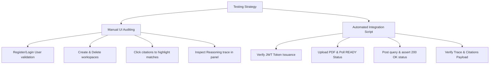

# Testing & Validation Strategy: Phoenix

This document defines the testing strategy, validation scopes, and verification procedures implemented to audit **Phoenix**.

---

## 1. Multi-Tier Testing Architecture

Phoenix is verified through a combination of manual visual checks and automated integration test scripts.

---

## 2. Automated Integration Testing

We use a Python-based test script to verify the RAG pipeline end-to-end.

### 2.1 Verified Operations
The script performs the following assertions:
1. **JWT Auth Verification**: Requests user registration (`POST /api/auth/register`) and login (`POST /api/auth/login`), asserting that a JWT token is successfully issued.
2. **Project Context Creation**: Dispatches `POST /api/projects` and extracts the UUID of the newly generated workspace.
3. **Ingestion Verification**: Uploads a test PDF document via `POST /api/documents/upload` and polls `GET /api/documents/{id}/status` until status changes from `PROCESSING` to `READY`.
4. **End-to-End Query Verification**: Submits a technical query via `POST /api/chat/query` and asserts the response payload properties:
   * **Answer Presence**: Verifies the answer contains non-empty Markdown content.
   * **Citations Presence**: Confirms the `matches` array contains matching chunks with valid `chunkIndex`, `score`, and document details.
   * **Reasoning Trace Accuracy**: Asserts that `reasoningTrace` records correct state objects (e.g. `INITIAL_RETRIEVAL`, `FALLBACK_REWRITE`, `FALLBACK_RERANK`, `ANSWER_GENERATION`).

---

## 3. RAG Algorithmic Validation

### 3.1 Property Key Sensitivity Test
To verify the benefits of hybrid search over vector-only search:
1. **Scenario**: Query the database for a specific configuration key like `spring.datasource.url`.
2. **Assertion**: Verify that the top-ranked result retrieved by the fusion algorithm contains the exact property key chunk, confirming that BM25 successfully elevated the chunk score above semantic-only matches.

### 3.2 Fallback Logic & Threshold Verification
Testing boundary limits ensures that the fallback state machine triggers the correct recovery paths:

* **Green Path ($CS \ge 0.75$)**:
  * *Input*: A precise question present in the document.
  * *Verification*: Assert trace lists `INITIAL_RETRIEVAL` -> `ANSWER_GENERATION`.
* **Yellow Path ($0.50 \le CS < 0.75$)**:
  * *Input*: An abbreviated query or minor term mismatch.
  * *Verification*: Assert trace lists `INITIAL_RETRIEVAL` -> `FALLBACK_REWRITE` -> `ANSWER_GENERATION`. Verify that the query was successfully rewritten to expand technical terms.
* **Orange Path ($0.35 \le CS < 0.50$)**:
  * *Input*: Broad questions with scattered context.
  * *Verification*: Assert trace lists `INITIAL_RETRIEVAL` -> `FALLBACK_RERANK` -> `ANSWER_GENERATION`. Confirm that FlashRank reranked scores are logged in the trace.
* **Red Path ($CS < 0.35$)**:
  * *Input*: Off-topic questions or empty documents.
  * *Verification*: Assert trace lists `INITIAL_RETRIEVAL` -> `FALLBACK_CLARIFY`. Verify that no answer is generated and the output is a polite clarification question.

---

## 4. Manual Verification Walkthrough

To perform manual system audits:
1. **User Identity Check**: Register a user with username `vaibhav`. Verify that the user profile widget, avatar icon (extracting initials `"VA"`), and sidebar display the name `"vaibhav"` instead of the email address.
2. **Project Cascading Cleanup**: Create a workspace, upload a document, and verify that the file is stored in `backend/storage/`. Delete the project in the workspace sidebar. Verify that the file is physically deleted from the storage directory and all corresponding records are removed from PostgreSQL.
3. **Citations Highlighting**: Submit a query. Click a citation block in the response. Verify that the right panel flashes the corresponding source chunk using the `.animate-pulse-highlight` animation.
