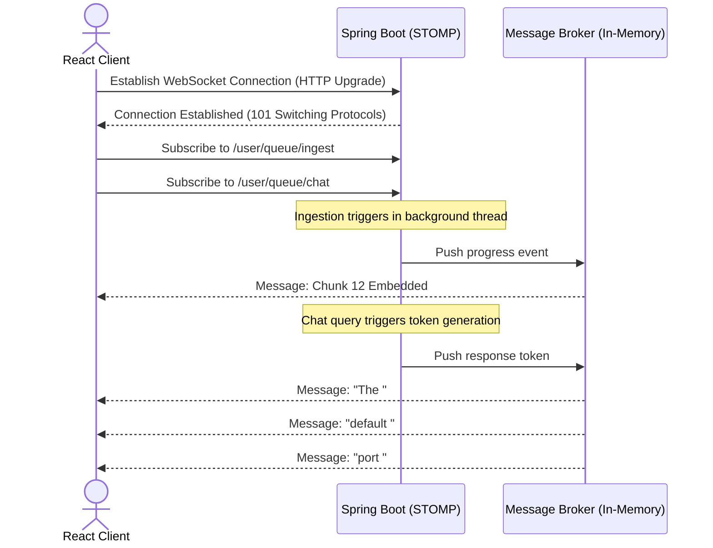

# WebSocket Architecture Specification (Planned Future Work)

This document outlines the planned real-time communication framework for **Phoenix**. It is a **future architecture specification** and is not part of the current implemented REST-based system.

---

## 1. Architectural Objective

Currently, the React Frontend relies on **HTTP polling** (`GET /api/documents/{id}/status`) to monitor background ingestion progress, and standard **HTTP POST block responses** (`POST /api/chat/query`) for query execution. 

Implementing a WebSocket layer will provide:
1. **Real-time Ingestion Progress**: Streaming granular parser step logs (e.g. "Extracting Page 12", "Generating Embeddings for Chunk 45") directly to the Document Vault console.
2. **Token Streaming**: Streaming LLM response tokens character-by-character to the Chat bubble, reducing perceived system latency.
3. **Execution Trace Animation**: Rendering timeline reasoning trace steps dynamically as they execute inside the AI engine orchestrator.

---

## 2. Planned Protocol & Lifecycle

WebSockets will be integrated into the Spring Boot API Gateway using the **STOMP (Simple Text Oriented Messaging Protocol)** sub-protocol over SockJS.



### 2.1 Connection Lifecycle
* **Endpoint Route**: `ws://localhost:8080/ws-connect`
* **Transport Protocols**: Native WebSockets, with fallback to SockJS polling for network compatibility.
* **Handshake Authentication**: The connection handshake will extract the JWT from the HTTP query parameters (e.g. `/ws-connect?token=<JWT>`) and validate it before switching protocols.

---

## 3. Planned Message Structures

All WebSocket frames will carry a standard JSON envelope:

```json
{
  "type": "INGEST_PROGRESS | CHAT_TOKEN | ERROR",
  "projectId": "UUID",
  "payload": {}
}
```

### 3.1 Ingestion Progress Frame
```json
{
  "type": "INGEST_PROGRESS",
  "projectId": "68a2878e-aa01-43c4-9f48-6ad150b7fe03",
  "payload": {
    "documentId": "a94936bc-f49d-424d-a90b-d1f159787da7",
    "fileName": "spring_boot_ref.pdf",
    "percentageComplete": 42.5,
    "currentStep": "EMBEDDING_GENERATION",
    "processedChunks": 65,
    "totalChunks": 154
  }
}
```

### 3.2 Chat Token Frame
```json
{
  "type": "CHAT_TOKEN",
  "projectId": "68a2878e-aa01-43c4-9f48-6ad150b7fe03",
  "payload": {
    "chatId": "f1d50c77-cb36-4899-a03a-66b2cddf4f81",
    "token": "8080",
    "isTerminal": false
  }
}
```

---

## 4. Reconnection & Error Strategy

* **Reconnection Engine**: The Zustand client store will implement an exponential backoff retry loop (starting at 1 second, doubling to a maximum of 30 seconds) on connection drop.
* **Fallback Mode**: If WebSocket handshakes fail repeatedly, the client will fall back to standard REST API operations, disabling real-time streaming interfaces.
