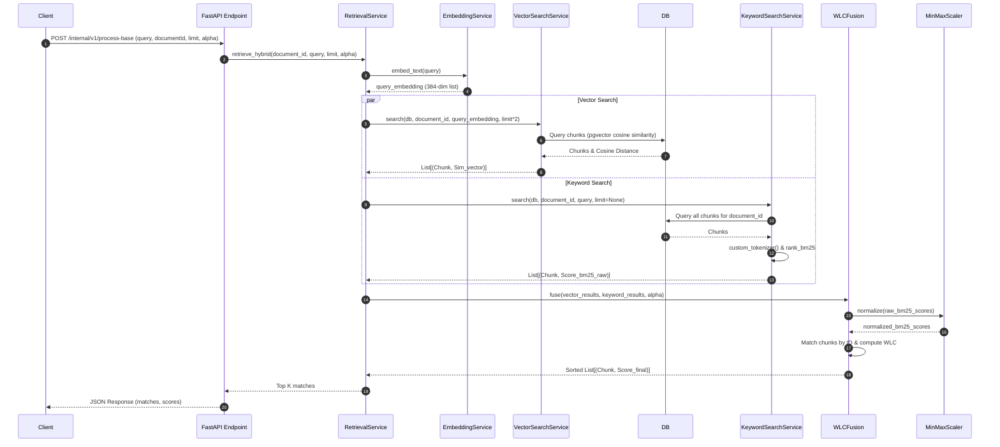

# Phoenix

Phoenix is a high-performance RAG-based AI search and retrieval platform.

## Hybrid Retrieval Engine Component Interaction

This diagram details the flow of execution when a client hits the hybrid retrieval endpoint:

